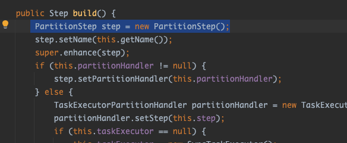
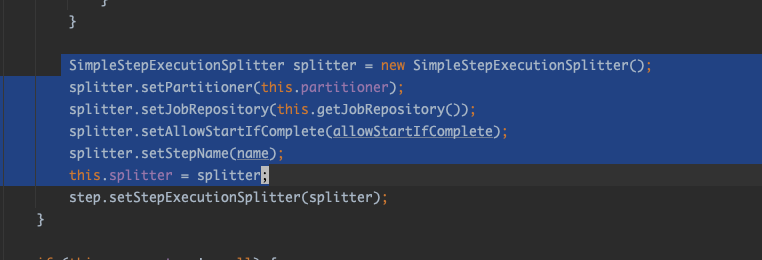

### 파티셔닝

파티셔닝은 하나의 마스터 스텝과 여러 워커 스텝으로 구성되며,
PartitionHandler 라는 클래스(구현체)를 통해 의사소통 한다.


스프링에는 파티셔닝을 위한 3가지 주요 구현체를 제공한다.

- TaskExecutorPartitionHandler
- MessageChannelPartitionHandler (원격 파티셔닝)
- deployerPartitionHandler (원격 파티셔닝)

파티셔닝을 사용하기 위해서는 마스터 스텝과 워커 스텝은 동일한 JobRepository 데이터베이스를 사용하도록 해야한다.   
그리고 원격 파티셔닝을 사용하는 경우에는 외부의 jvm 과의 상호작용을 위한 통신이 가능해야 한다.

---

##### TaskExecutorPartitionHandler

파티셔닝을 시작해볼 수 있는 가장 간단한 방법으로 단일 jvm 내에서 여러 스레드를 사용해서 워커를 생성/실행한다.

사용되는 배치 컴포넌트들을 이미지로 간단히 보면...


위 2번은 지금까지 봐왔던 기본적인 배치 스텝 구조이고, 1번의 partition 관련된 컴포넌트를 통해서 2번의 스텝을 스레드로 파티션을 나누어 처리하게 된다.

1번 관련된 코드들을 살펴보자.

job, step
```java
@Bean
public Job partitionedJob() throws Exception {
    return this.jobBuilderFactory.get("partitionedJob")
            .start(partitionedMaster())
            .build();
}

@Bean
public Step partitionedMaster() {
    return this.stepBuilderFactory.get("masterStep1")
            .partitioner(step1().getName(), partitioner(null))
            .partitionHandler(partitionHandler())
            .build();
}
```

partitioner, partitionHandler
```java
@Bean
public TaskExecutorPartitionHandler partitionHandler() {
    TaskExecutorPartitionHandler partitionHandler = new TaskExecutorPartitionHandler();

    partitionHandler.setStep(step1());
    partitionHandler.setTaskExecutor(new SimpleAsyncTaskExecutor());
    return partitionHandler;
}

@Bean
@StepScope
public MultiResourcePartitioner partitioner(
        @Value("#{jobParameters['inputFiles']}") Resource[] resources
) {

    MultiResourcePartitioner partitioner = new MultiResourcePartitioner();
    partitioner.setKeyName("file");
    partitioner.setResources(resources);

    return partitioner;
}
```

```java
@Bean
@StepScope
public FlatFileItemReader<Transaction2> fileTransactionReader(
        @Value("#{stepExecutionContext['file']}") Resource resource
) {
    return new FlatFileItemReaderBuilder<Transaction2>()
            .name("flatFileTransactionReader")
            .resource(resource)
            .delimited()
            .names("account", "amount", "timestamp")
            .fieldSetMapper(fieldSet -> {
                Transaction2 transaction = new Transaction2();
                transaction.setAccount(fieldSet.readString("account"));
                transaction.setAmount(fieldSet.readBigDecimal("amount"));
                transaction.setTimestamp(fieldSet.readDate("timestamp", "yyyy-MM-dd HH:mm:ss"));

                return transaction;
            })
            .build();
}
```
job 은 기존과 크게 다르지 않지만, step 부터는 조금 다르다.   
지금까지 봐왔던 step 은 보통 chunk() 빌더 메소드를 활용했었지만 위에서는 partitioner() 빌더 메소드를 사용한다.  

간단히 아래와 같이 설명된다.  
- partitionHandler 메소드로부터 워커스텝으로 사용할 스텝(워커 스텝)을 지정하고,   
- 설정한 워커 스텝 실행 시 스레드 생성 전략을 위한 인스턴스를 매개변수로 전달하고,  
- partitioner 메소드에서 지정한 리소스 별로 파티션을 나눈다.

---

그럼 위 코드의 예제는 어떤 코드에 의해 **파티션**이 나뉘어지고 **워커 스텝**이 실행될까?

partitioner() 빌더 메소드를 사용하면 PartitionStepBuilder 클래스를 인스턴스로 사용하고


PartitionStepBuilder 클래스의 build() 메소드를 보면 PartitionStep 클래스를 사용한다.



PartitionStep 에 partitionHandler 와 stepExecutionSplitter 를 설정하는 부분이 있다.

this.partitionHandler 는 처음에 매개변수로 주어진 TaskExecutorPartitionHandler 인스턴스이고


build() 메소드를 조금 더 내려보면 stepExecutionSplitter 는 partition 스텝 구성 시 splitter 를 초기화 시키지 않았다면, SimpleStepExecutionSplitter 클래스를 사용한다.




추후 실제 job과 step 이 실행이 될때 PartitionStep 클래스의 doExecute() 메소드가 호출이되는데 해당 메소드로 부터 워커 스텝이 나뉘어지고 실행된다.


위에 보이듯이 this.partitionHandler 의 handle 메소드가 호출되면 SimpleStepExecutionSplitter 클래스의 split() 메소드가 호출된다. 
> default gridsize = 1 인것도 확인할 수 있지만, MultiResourcePartitinor 클래스를 사용하면 resources 의 개수만큼 파티션이 나뉜다.


해당 메소드의 코드를 간단히 살펴보면 마스터 스텝의 partitioner 로 지정했던 MultiResourcePartitioner 클래스의 partition 메소드가 실행된다.


this.partitioner 는 MultiResourcePartitioner 클래스의 인스턴스를 참조하고 있는 변수이다.


this.resources 만큼 반복문을 돌리면서 파티션 생성을 위한 map 을 만들고 리턴한다.   
이러한 과정을 거쳐서 context 는 파티션이 나뉘게 되고, 각 파티션은 서로다른 스레드에서 실행된다.


> 리턴된 변수를 통해 batch_step_execution 테이블과 batch_step_execution_context 테이블의 데이터가 업데이트됨.

그후에 마스터 스텝에서 설정했던 TaskExecutorPartitionHandler 에 전달되고   
task 가 생성된후에 execute() 메소드를 통해 워커스텝이 실행된다.


위 this.step 은 마스터 스텝 설정 시 TaskExecutorPartitionHandler 의 setStep 매개변수로 전달된 워커 스텝이다.


위 코드들을 따라가보면서 간단히 어떤 방식으로 파티션이 나뉘고 워커 스텝이 실행되는지 확인했다.   


위에서 봤던 이미지를 다시 보면서 내용을 한번 더 확인해보면.  

- partitioner 는 어떻게 파티션을 나누는지 partition 메소드로 결정했었고  
- partitionHandler 는 
	+ 실행시킬 워커 스텝을 설정했고, 
	+ 워커스텝을 실행시킬때 어떤 방식으로 스레드를 생성할지를 설정하고,
	+ 실제로 워커스텝을 실행시켰다.

---

##### MessageChannelPartitionHandler

원격 파티셔닝 방법으로 마스터 스텝과 워커 스텝을 다른 jvm 에서 실행하도록 하며,
각 워커에는 완전한 스텝 형태로 item reader, processor, writer 를 갖추고 있다.

예를 들면 아래 이미지와 같다.


원격 파티셔닝은 아이템을 처리(연산)하는데 시간이 걸리는 작업보다, i/o 관련 작업 시간이 오래걸릴때 사용한다.

---

##### deployerPartitionHandler

클라우드 환경에서 원격 파티셔닝의 이점을 얻을 수 있도록 스프링에서 제공하는 partitionHandler 구현체이다.

동작 시 흐름은 위의 MessageChannelPartitionHandler 방식과 유사하지만,
차이점은 워커 스텝을 동적으로 관리해준다는데에 있다.

MessageChannelPartitionHandler 는 워커를 실행시킬 jvm 서버들을 수동으로 준비시켜 놓아야 하기 때문에 서버의 리소스도 최대 필요한 만큼 항상 띄워 놓아야 한다.


반면, deployerPartitionHandler 방식을 이용하면 워커 스텝을 수동으로 띄울 필요가 없고 파티션 당 최대로 띄울 워커 스텝 수를 지정해놓으면 자동으로 필요한 만큼만 리소스를 사용한다.


아래와 setMaxWorkers(1); 로 지정되면 파티션 당 최대 1개의 워커 스텝만 실행시킨다.

```java
@Bean
public PartitionHandler partitionHandler(TaskLauncher taskLauncher, JobExplorer jobExplorer) throws Exception {
    Resource resource = this.resourceLoader
        .getResource("maven://io.spring.cloud:partition:0.0.1-SNAPSHOT");

    DeployerPartitionHandler partitionHandler =
        new DeployerPartitionHandler(taskLauncher, jobExplorer, resource, "workerStep");

    List<String> commandLineArgs = new ArrayList<>(3);
    commandLineArgs.add("--spring.profiles.active=worker");
    commandLineArgs.add("--spring.cloud.task.initialize.enable=false");
    commandLineArgs.add("--spring.batch.initializer.enabled=false");
    partitionHandler
        .setCommandLineArgsProvider(new PassThroughCommandLineArgsProvider(commandLineArgs));
    partitionHandler
        .setEnvironmentVariablesProvider(new SimpleEnvironmentVariablesProvider(this.environment));
    partitionHandler.setMaxWorkers(1); <---
    partitionHandler.setApplicationName("PartitionedBatchJobTask");

    return partitionHandler;
}
```
---

### 원격 청킹

원격 청킹 방식은 아이템을 읽거나(read), 쓸때(write) 보다 처리(process) 할때 많은 병목이 생기는 경우에 사용도 고려할만하다.

원격 파티셔닝과 차이점은 원격 청킹은 마스터 스텝에서 아이템을 읽는 작업(read) 만 진행하고 처리(process)/쓰기(writer) 는 모두 워커 스텝에 위임한다. 

Step2 에 보면 process 자리가 비어있는데, 해당 작업을 워커 스텝에서 처리하도록 하며 itemWriter 는 워커 스텝의 처리 결과에 대한 추가 작업(기록 등)을 할 수 있다.

아이템을 읽는 건 마스터 스텝에서 진행하고, 읽고 난 뒤에 작업은 각 워커스텝에 전달만하기 때문에,   
어떤 서버에서 아이템을 처리하고 있는지 알 길이 없다.   
mq 등을 사용해서 메세지가 유실되지 않는다는 것이 보장되어야 한다.


원격 청킹의 간단한 구성도는 아래와 같다.


예전에 찾아봤던 내용 복붙..


