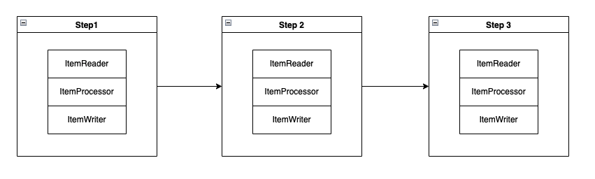
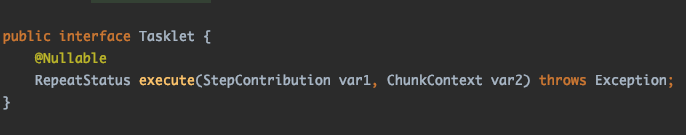
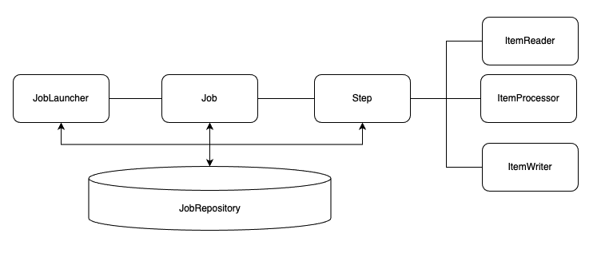
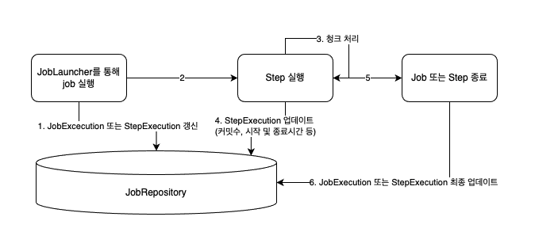
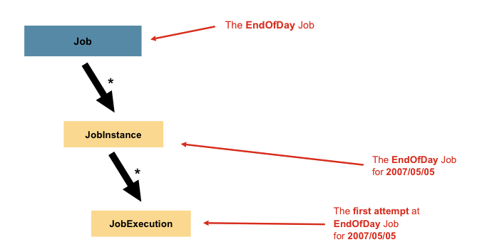
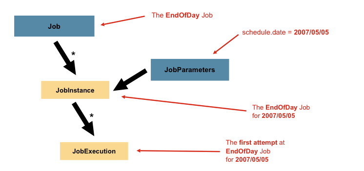
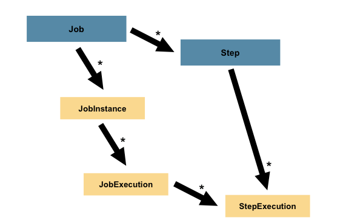

## spring batch
> 배치 아키텍처와 간단한 예제를 설명한다.

1. [잡과 스텝](#-잡과-스텝)
2. [잡 실행](#-잡-실행)
3. [병렬화](#병렬화)
4. [예제](#-예제)

---

### 1. 잡과 스텝
"**스프링 배치 잡**은 개념적으로 상태 기계에 지나지 않는다."

그럼 상태 기계가 무엇인가?   
간단히 검색해보면 **각 상태(state)를 특정한 조건(event)에 따라서 연결되어 있는 다른 상태로 전이시키는 장치**라고 한다.   

상태 기계가 **잡**이라면 상태는 **스텝**이다.   
스텝은 아래 이미지와 같이 스텝과 스텝으로 연결되어 있을수 있으며 스텝은 **태스크릿**과 **청크** 라는 두가지 유형으로 나뉜다. (아래 예시 이미지는 청크 유형)

#### 태스크릿(tasklet)

태스크릿은 청크 기반 스텝보다 구조가 간단하며 초기화, 프로시저 실행, 알림 전송등 단순한 작업에서 사용된다.   
단순히 Tasklet 인터페이스를 구현하기만 하면되고, 해당 인터페이스에는 execute 메서드만 존재하기 때문에 복잡하지 않다.    
(특정한 조건으로 스텝을 중지하기 전까지 execute 메서드가 반복실행되며 해당 메서드가 호출될때마다 독립적인 트랜잭션을 갖는다.)

#### 청크(chunk)

청크 기반 스텝은 ItemReader, ItemProcessor, ItemWriter 라는 3개 부분으로 구성될 수 있으며 주로 아이템 기반 처리작업에 사용된다.   
(자세한 내용은 책 공부하며 차차 진행..)

#### 정리

스프링 배치는 잡과 스텝으로 구성되며 스텝을 독립적으로 구성할 수 있으므로 많은 이점을 얻을 수 있다.

- 유연성 : 로직을 재사용하기 쉽도록 여러가지 빌더 클래스를 제공한다. (start, next, on 등.. 을 말하는듯함.)
- 유지보수성 : 스텝이 독립적이므로 스텝별로 쉽게 테스트코드, 디버그를 할 수 있다.
- 확장성 : 특정 스텝을 병렬로 실행시킬 수 있다.
- 신뢰성 : 특정 스텝의 예외발생 시 재시도/건너뛰기 등 동작을 수행할 수 있다.

### 2. 잡 실행

잡 컴포넌트 및 관계를 간단히 살펴본다.

JobRepository 는 배치 수행과 관련된 데이터들을 관계형 데이터베이스에 저장해두고 다른 컴포넌트들과 상호작용할 수 있다.

JobLauncher 는 잡을 실행시키는 역할을 하는 컴포넌트이고 잡의 재실행 여부, 실행 방법, 파라미터 유효성 검증 등의 처리를 한다.   
(스프링부트에서는 따로 구현하지 않아도 동작한다.)

대충 디비와 엮어져 돌아가는 방식은 아래와 같다.   

그럼 JobExecution, StepExecution 은 무엇인가?

먼저 job 의 컨셉/구조를 조금씩 살펴보자.   

**Job**은 여러개의 스텝을 구성할 수 있는 최상위 컨테이너이며, 잡의 이름과 스텝 구성 및 실행 순서 그리고 재실행 가능여부 등을 구성할 수 있다.

**JobInstance** 는 Job 실행시의 논리적 실행단위로, Job 이 동작하면 해당 Job 은 무조건 한개의 JobInstance 만이 존재한다.   
위 그림으로 예를들면, 하루에 한번 도는 배치를 의미하는 그림으로 07년 5월 5일에 잡인스턴스가 하나 생성된다.   
(책에도 다음과 같이 나와있다. "잡의 이름과 잡의 논리적 실행을 위해 제공되는 고유한 식별 파라미터 모음으로써 유일하게 존재한다")

그럼 언제 새로운 잡인스턴스가 생성되는가? 
JobParameter 가 변경되면 새로운 잡인스턴스가 생성된다.

JobInstance = Job + JobParameter 라고 한다.

**JobExecution 은 무엇인가?**

단일 작업 실행시도를 의미한다고 한다.   
JobExecution 은 실패 또는 성공을 할 수 있다. 하지만, jobInstance 는 실패하는 경우는 완료한것으로 간주하지 않는다.   
즉, JobExecution 매번 새로운 데이터가 추가되지만 동일한 jobparameter 를 가지고 실패하는 경우 jobInstance 는 동일하다.

**Step 과 StepExecution** 

Step 은 실제 배치 처리를 조작 및 제어한다.  
Job 에는 JobExecution 이 있는것처럼 Step 은 여러 StepExecution 을 가질 수 있다.

StepExecution 은 JobExecution 과 연관되어 있으며, StepExecution 에는 실행 상태에 대한 모든 정보를 포함하고 있다. 
(ExecutionContext 라는것이 있다고한다.)

### 3. 병렬화

#### 다중 스레드 스텝

#### 병렬 스텝

#### 원격 청킹

#### 파티셔닝

### 4. 예제