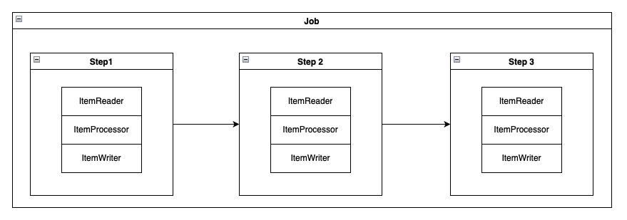
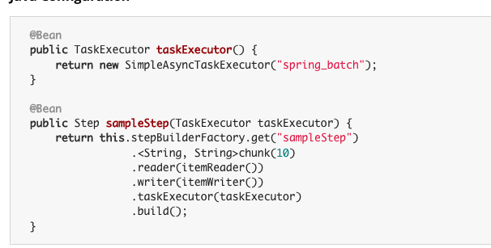
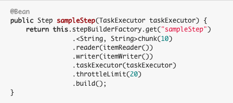
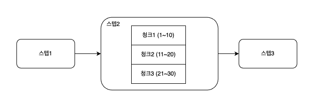
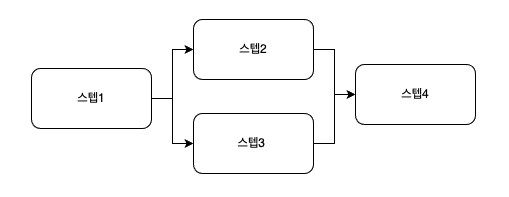
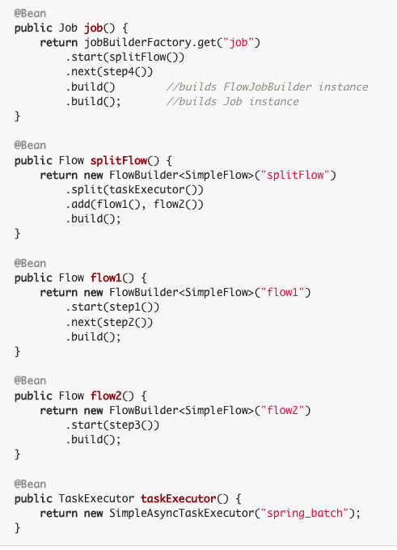
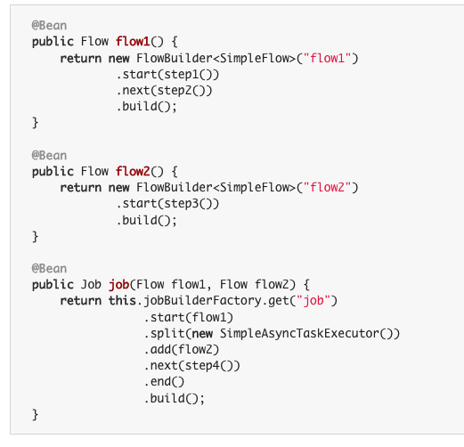
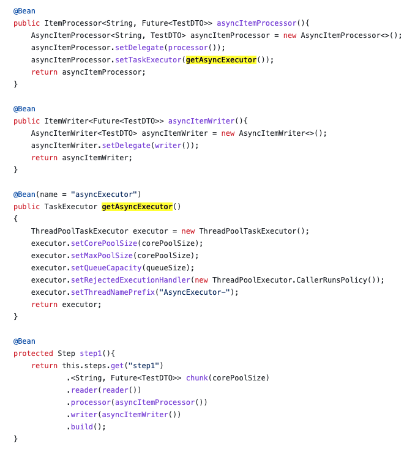
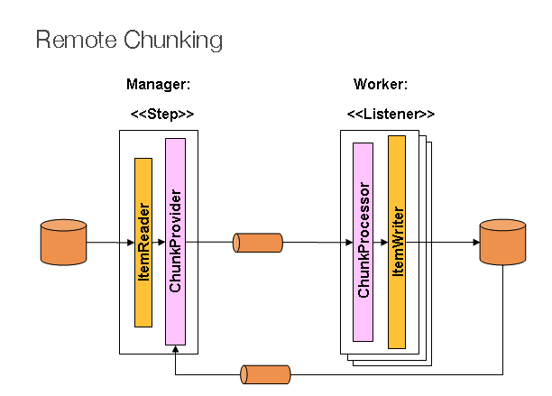
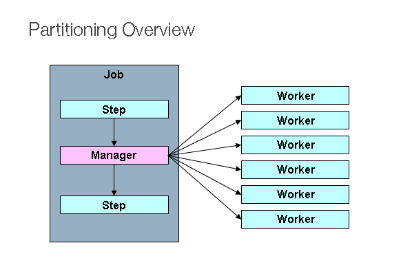

## spring batch
> 배치 아키텍처와 간단한 예제를 설명합니다.

1. [잡과 스텝](#-잡과-스텝)
2. [잡 실행](#-잡-실행)
3. [병렬화](#병렬화)

---

### 1. 잡과 스텝
"**스프링 배치 잡**은 개념적으로 상태 기계에 지나지 않는다."

그럼 상태 기계가 무엇인가?   
간단히 검색해보면 **각 상태(state)를 특정한 조건(event)에 따라서 연결되어 있는 다른 상태로 전이시키는 장치**라고 한다.   

상태 기계가 **잡**이라면 상태는 **스텝**이다.   
스텝은 아래 이미지와 같이 스텝과 스텝으로 연결되어 있을수 있으며 스텝은 **태스크릿**과 **청크** 라는 두가지 처리방식을 지원한다. (아래 예시 이미지는 청크 유형 방식)

#### 태스크릿(tasklet)

태스크릿은 청크 기반 스텝보다 구조가 간단하며 초기화, 프로시저 실행, 알림 전송등 단순한 작업에서 사용된다.   
단순히 Tasklet 인터페이스를 구현하기만 하면되고, 해당 인터페이스에는 execute 메서드만 존재하기 때문에 복잡하지 않다.    
(특정한 조건으로 스텝을 중지하기 전까지 execute 메서드가 반복실행되며 해당 메서드가 호출될때마다 독립적인 트랜잭션을 갖는다.)

#### 청크(chunk)

청크 기반 스텝은 ItemReader, ItemProcessor, ItemWriter 라는 3개 부분으로 구성될 수 있으며 주로 아이템 기반 처리작업에 사용된다.   

- itemReader 는 itemProcessor/itemWriter 에서 사용할 아이템을 읽는 작업을 진행한다.
- itemProcessor 는 실제 로직 구성과 관련된 작업을 진행
- itemWriter 는 처리된 아이템들을 저장하는 작업을 진행

#### 정리

스프링 배치는 잡과 스텝으로 구성되며 스텝을 독립적으로 구성할 수 있으므로 많은 이점을 얻을 수 있다.

- 유연성 : 로직을 재사용하기 쉽도록 여러가지 빌더 클래스를 제공한다. (start, next, on 등.. 을 말하는듯함.)
- 유지보수성 : 스텝이 독립적이므로 스텝별로 쉽게 테스트코드, 디버그를 할 수 있다.
- 확장성 : 특정 스텝을 병렬로 실행시킬 수 있다.
- 신뢰성 : 특정 스텝의 예외발생 시 재시도/건너뛰기 등 동작을 수행할 수 있다.

### 2. 잡 실행

잡 컴포넌트 및 관계를 간단히 살펴본다.

JobRepository 는 배치 수행과 관련된 데이터들을 관계형 데이터베이스에 저장해두고 다른 컴포넌트들과 상호작용할 수 있다.

JobLauncher 는 잡을 실행시키는 역할을 하는 컴포넌트이고 잡의 재실행 여부, 실행 방법, 파라미터 유효성 검증 등의 처리를 한다.   
(스프링부트에서는 따로 구현하지 않아도 동작한다.)

대충 디비와 엮어져 돌아가는 방식은 아래와 같다.   

그럼 JobExecution, StepExecution 은 무엇인가?

먼저 job 의 컨셉/구조를 조금씩 살펴보자.   

**Job**은 여러개의 스텝을 구성할 수 있는 최상위 컨테이너이며, 잡의 이름과 스텝 구성 및 실행 순서 그리고 재실행 가능여부 등을 구성할 수 있다.

**JobInstance** 는 Job 실행시의 논리적 실행단위로, Job 이 동작하면 해당 Job 은 무조건 한개의 JobInstance 만이 존재한다.   
위 그림으로 예를들면, 하루에 한번 도는 배치를 의미하는 그림으로 07년 5월 5일에 잡인스턴스가 하나 생성된다.   
(책에도 다음과 같이 나와있다. "잡의 이름과 잡의 논리적 실행을 위해 제공되는 고유한 식별 파라미터 모음으로써 유일하게 존재한다")

그럼 언제 새로운 잡인스턴스가 생성되는가? 
JobParameter 가 변경되면 새로운 잡인스턴스가 생성된다.

JobInstance = Job + JobParameter 라고 한다.

**JobExecution 은 무엇인가?**

단일 작업 실행시도를 의미한다고 한다.   
JobExecution 은 실패 또는 성공을 할 수 있다. 하지만, jobInstance 는 실패하는 경우는 완료한것으로 간주하지 않는다.   
즉, JobExecution 매번 새로운 데이터가 추가되지만 동일한 jobparameter 를 가지고 실패하는 경우 jobInstance 는 동일하다.

**Step 과 StepExecution** 

Step 은 실제 배치 처리를 조작 및 제어한다.  
Job 에는 JobExecution 이 있는것처럼 Step 은 여러 StepExecution 을 가질 수 있다.

StepExecution 은 JobExecution 과 연관되어 있으며, StepExecution 에는 실행 상태에 대한 모든 정보를 포함하고 있다. 
(ExecutionContext 라는것이 있다고한다.)

### 3. 병렬화

배치 처리를 병렬화할 수 있는 방법으로 아래 5가지가 방법이 간단히 소개합니다.   

- 다중스레드 스텝
- 전체 스텝 병렬 실행
- 비동기 itemProcessor,itemWriter
- 원격 청킹
- 파티셔닝

#### 다중 스레드 스텝

병렬화 중에 가장 간단한 방법으로 TaskExecutor 를 이용한 방법이다.   
TaskExecutor 구현체들을 사용해서 스레드를 생성해서 itemReader, itemWriter 를 **청크별로 다른 스레드에서 병렬로 실행**하도록 한다.   

**주의!** 
멀티스레드로 동작하기 때문에 사용하려는 itemReader, itemWriter 클래스가 thread-safe 한 클래스인지 확인이 필요하다.)

위 이미지에 SimpleAsyncTaskExecutor 는 새로운 스레드가 계속 생성되는 구현체.   

> 스로틀 제한은 해당 작업을 처리하는데 몇개의 스레드를 사용할 것인지 제한하도록 스프링 배치에서 제공하는 메소드. 기본값 4     
> 보통 core pool size, max pool size, throttleLimit 은 똑같은 값으로 지정한다고 함.  
>> core pool size 는 몇개의 스레드를 사용할건지, max pool size 는 최대 개수, 스로틀 제한은 코어풀개수와 상관없이 배치 작업에서는 스로틀 제한만큼만 스레드가 사용됨.
>> 
위 예제코드에서는 청크가 10이므로 10개씩 다른 스레드에서 스텝이 실행됨.    

공식문서에 나와 있는 내용이 아래 블로그에 그대로 설명되어 있고, 부가적인 설명도 있음. (시간될때 한번 읽어보시면 좋을듯)   
공식문서 - https://docs.spring.io/spring-batch/docs/current/reference/html/scalability.html#multithreadedStep.  
블로그 - https://jojoldu.tistory.com/493

#### 병렬 스텝

병렬 스텝은 스텝 자체를 병렬로 실행하는 방법. (다중 스레드 스텝은 스텝내의 아이템 처리를 병렬로 처리하는게 다름.)    
step2 과 step3 가 서로 기다릴 필요없는 작업인 경우에 사용한다.

간단히 사용법을 보면, split() 메소드를 사용해서 TaskExecutor 를 이용함.   
flow1(), flow2() 이 병렬로 실행됨.  
(step1, step2) 를 (step3) 과 병렬로 실행

아래는 다른 예제.
flow1과 flow2 가 병렬로 실행됨.

#### 비동기 itemProcessor,itemWriter

기본 개념은 데이터를 읽거나 조회하는 itemReader 는 순차적으로 실행되며(동기), 읽어온 데이터를 처리하는 processor, writer 는 비동기로 실행된다.
(itemReader 는 아이템을 읽어서 작업이 끝날때까지 기다리지 않고 그냥 던지고 다시 아이템을 읽음.)

아래 예시코드와 같이 AsyncItemProcessor, AsyncItemWriter 를 사용해서 구현하며 해당 클래스를 사용하려면
spring-batch-integration 의존성이 필요하다.

asyncItemProcessor 는 결과값을 바로 주지 않고 Future 를 반환하면 itemWriter 에서는 future 에 반환된 값을 이용해 데이터를 처리한다.

#### 원격 청킹

원격청킹 방식은 itemReader 에 비해 아이템을 처리하는 processor/writer 의 비용이 훨씬 큰 경우에 적합하다.
(그리고 네트워크 i/o 비용이 적은 시나리오에 적합.)

기본 개념.
itemReader 를 실행하는 서버와 itemProcessor 혹은 itemWriter 를 실행하는 서버가 다른 서버에 위치한다.
아이템을 읽는 itemReader 는 마스터노드가 되고 읽은 아이템을 메시지큐와 같은 메시지 브로커를 이용해 워커노드에게 처리하도록 한다.

대략 아래그림으로 보면

 - 매니저 스텝(단일 프로세스/스레드)에서는 item 을 읽어서 메시지 브로커에 전송(produce)
 - 메시지를 받은 리스너(여러 리모트 서버들)에서 item 을 받아와서(comsume) 처리 (db 까지 저장)
 - 완료사항 전달 및 처리

코드 예시는 공식문서 참고.   
https://docs.spring.io/spring-batch/docs/current/reference/html/spring-batch-integration.html#remote-chunking

#### 파티셔닝

파티셔닝은 마스터 스텝, 워커 스텝이 별도로 존재하는 구조.   
마스터 스텝은 단지 워커 스텝을 얼만큼 파티션으로 나눌지 결정하고(PartitionStep) 파티셔닝된 워커스텝(Tasklet, Flow)들은 병렬로 작업을 처리한다.

원격청킹과는 달리 파티셔닝의 워커스텝은 itemReader, itemProcessor, itemWriter 를 모두 가지고 동작하며, 
병렬로 실행된 워커스텝이 모두 종료되는 경우 마스터 스텝도 완료된것으로 간주한다.
