## 잡 실행하기

### 스프링 부트로 배치 잡 시작시키기

스프링 부트는 별도의 잡 런처가 없어도 배치 잡을 자동으로 실행할수도 있고, 환경변수를 이용해 자동으로 실행되지 않도록 할 수도 있다.

책에 "ApplicationContext 가 리프레시 되고 애플리케이션이 코드를 실행할 준비가 된 이후에 호출되는 하나의 메서드를 가지고 있다" 라고 써있는데 무슨 얘기인지 정확히 이해가 안된다.

소스코드를 조금 살펴보고 다시 읽으면 대충은 이해가 되는데 spring boot 는 서버 기동시에 di 을 위해 빈들을 등록하는 로직이 실행된다. 이 로직들이 리프레시 되는 부분이고 "호출되는 하나의 메서드를 가지고 있다" 는 SpringApplication 클래스에서 배치를 실행시키는 메소드를 가지고 있는것을 얘기하는것 같다.
> SpringApplication 의 callRunners 메소드를 따라가다보면 JobLauncherApplicationRunner 클래스의 run 을 호출하는 부분이 있음.

> 그리고 책에는 JobLauncherCommandLineRunner 클래스를 얘기하는데, spring boot 2.3.0 버전부터 deprecated 되고 JobLauncherApplicationRunner 가 사용된다.

그리고 스프링 부트에서 자동으로 잡이 실행되지 않도록 설정할 수 있다.
spring.batch.job.enabled 를 false 로 설정하면 된다.   

그리고 @EnableBatchProcessing 어노테이션을 추가하면 
해당 설정을 false 로 하면 BatchAutoConfiguration 클래스에 JobLauncherApplicationRunner 를 빈으로 등록할지 말지 결정하는 부분에서 bean 이 등록되지 않도록 한다.

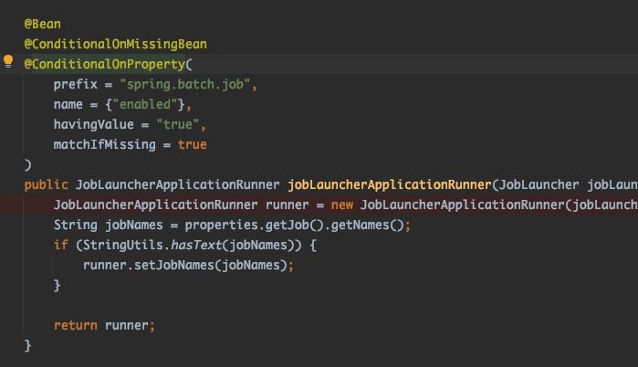

OnPropertyCondition 클래스에서 결정하는 로직이 존재함.

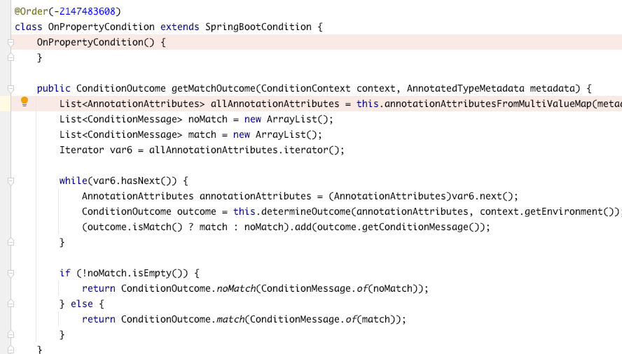

간단히 job execute 되는 부분까지 따라가봄.

 [펼쳐보기] job executer 까지 따라가보기 

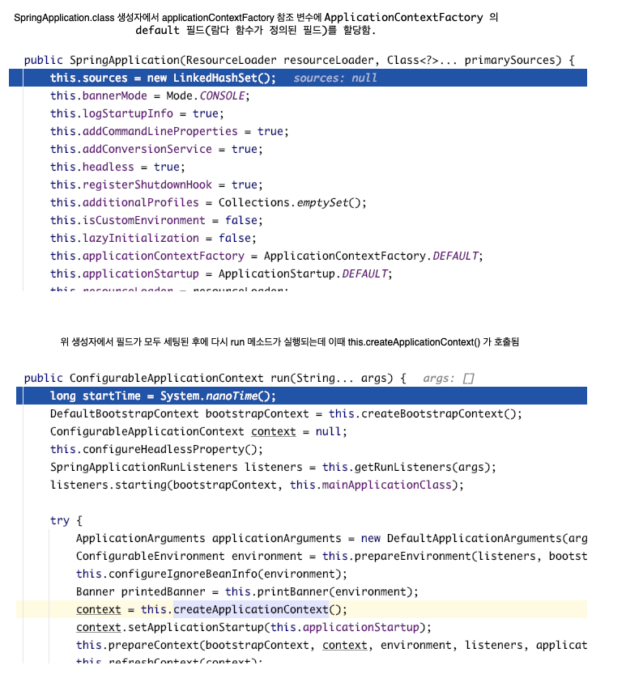
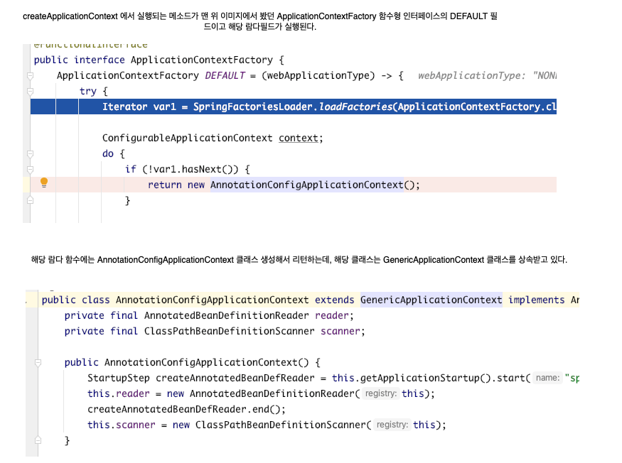
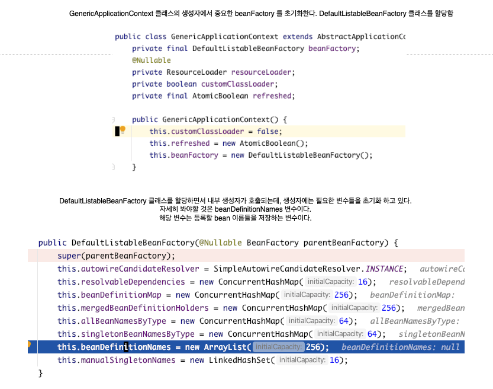

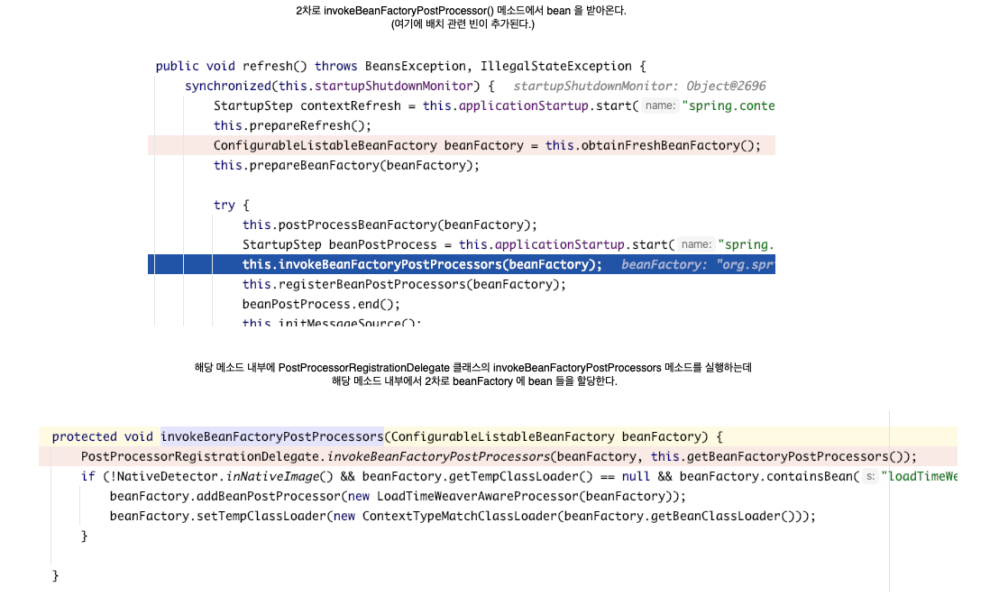
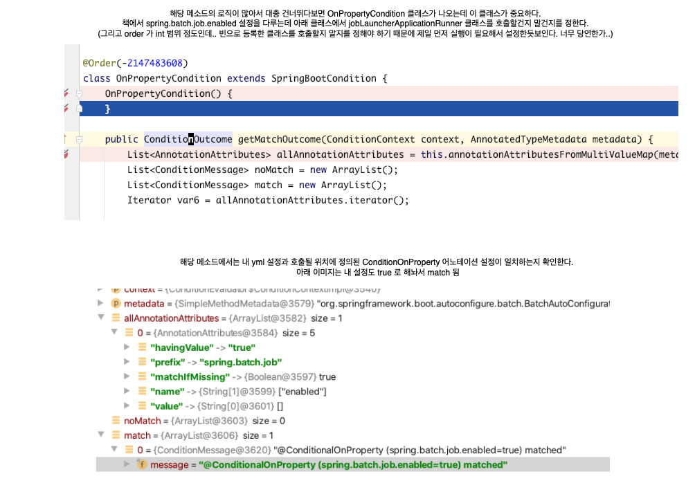
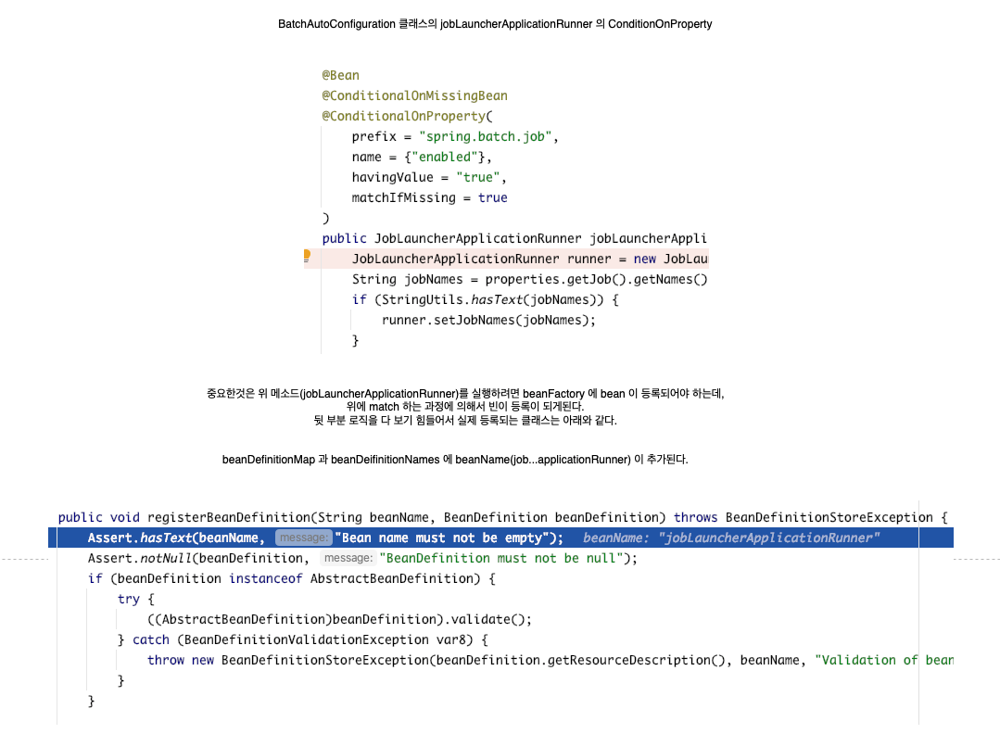
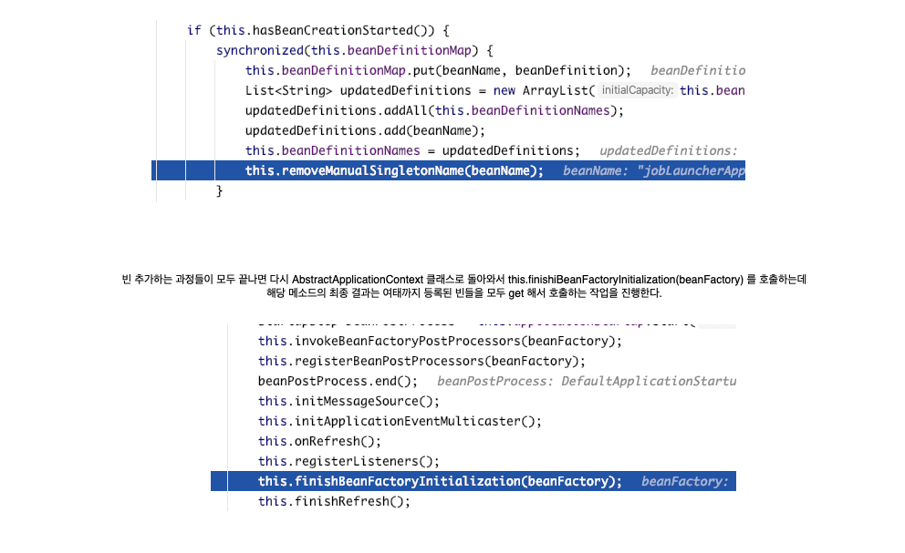
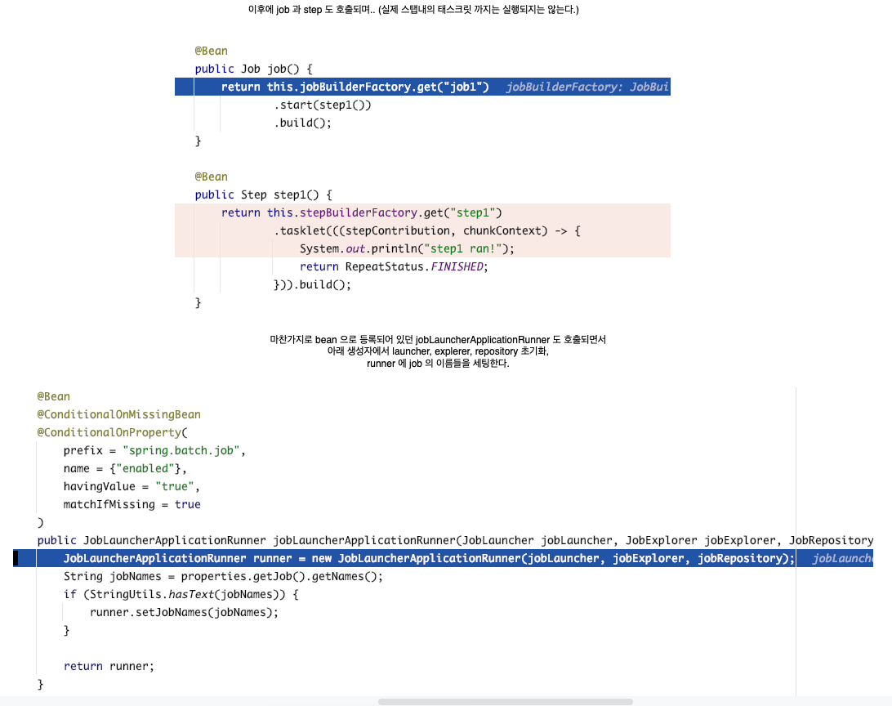
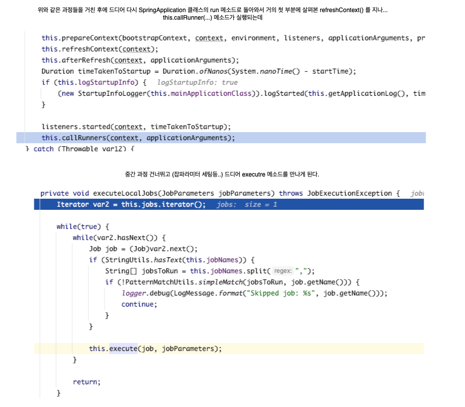

---

#### 프로퍼티로 실행시키고 싶은 잡만 실행시키기

만약 job 이 여러개가 존재할때 특정 job 만 실행시키고 싶은 경우에는 spring.batch.job.names 설정에 실행할 job 이름을 추가하면 된다.

아래와 같이 job3, job4 가 있을때 스프링 부트를 실행하면 두개 잡 모두 실행된다.
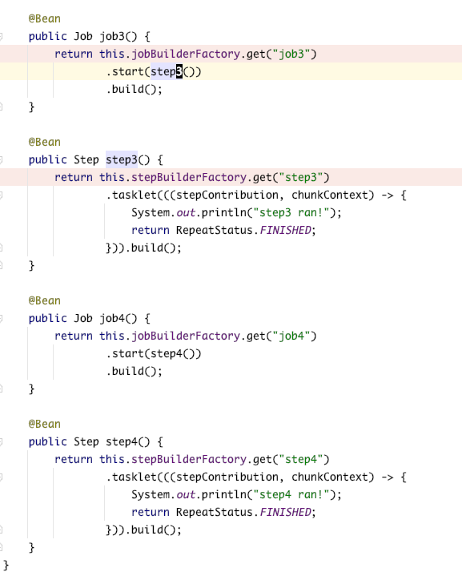

spring.batch.job.names 설정에 job4 만 추가하면 job4 만 실행됨

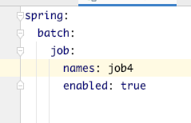

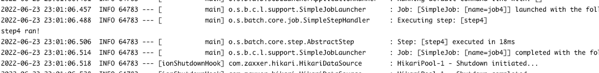

JobLauncherApplicationRunner 클래스를 초기화할때 프로퍼티(spring.batch.job.names)로 설정한 jobNames (job4)를 추가하는데,
JobLauncherApplicationRunner 클래스의 execute 메소드를 실행하기전에 StringUtils.hasText 로 해당 job 을 체크해서 실행한다.

아래 이미지는 BatchAutoConfiguration 클래스에서 JobLauncherApplicationRunner 클래스를 초기화하는 부분
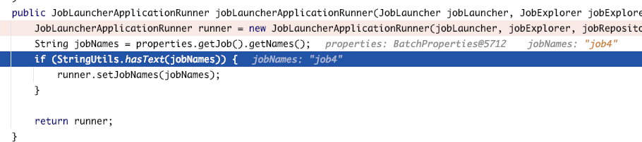

아래 이미지는 JobLauncherApplicationRunner 클래스에서 execute 메소드 내부 로직.
this.jobNames 가 프로퍼티로 등록한 잡이름들이고, simpleMatch 가 false 면 execute 메소드를 실행하지 않고 continue 해버림.

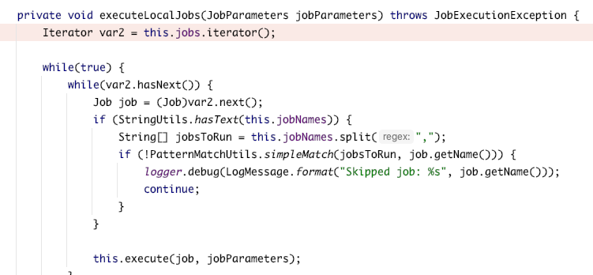

### REST 방식으로 잡 실행하기

### 쿼츠를 사용해 스케줄링하기
