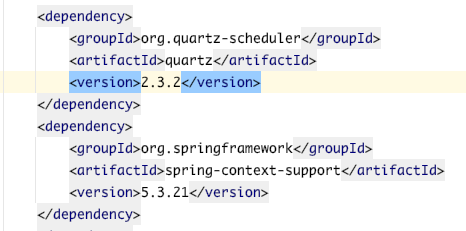
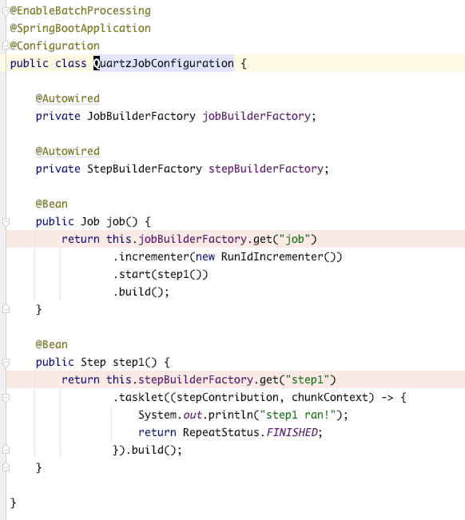

## 잡 실행하기

### 스프링 부트로 배치 잡 시작시키기

스프링 부트는 별도의 잡 런처가 없어도 배치 잡을 자동으로 실행할수도 있고, 환경변수를 이용해 자동으로 실행되지 않도록 할 수도 있다.

책에 **"ApplicationContext 가 리프레시 되고 애플리케이션이 코드를 실행할 준비가 된 이후에 호출되는 하나의 메서드를 가지고 있다"** 라고 써있는데 무슨 얘기인지 정확히 이해가 안된다.

소스코드를 조금 살펴보고 다시 읽으면 대충은 이해가 되는데,   
**"ApplicationContext 가 리프레시"** 는 spring boot 가 서버 기동시에 di 를 위해 빈들을 등록하는 로직이 있는데 해당 과정중에 refresh() 메소드를 실행시키는 부분이 있다.

**"호출되는 하나의 메서드를 가지고 있다"** 는 SpringApplication 클래스에서 배치를 실행시키는 메소드를 가지고 있는것을 얘기하는것 같다.

> SpringApplication 의 callRunners 메소드를 따라가다보면 JobLauncherApplicationRunner 클래스의 run 을 호출하는 부분이 있음.

> 그리고 책에는 JobLauncherCommandLineRunner 클래스를 얘기하는데, spring boot 2.3.0 버전부터 deprecated 되고 JobLauncherApplicationRunner 가 사용된다.

---

스프링 부트에서 자동으로 잡이 실행되지 않도록 설정할 수 있다.   
spring.batch.job.enabled 프로퍼티 설정을 false 로 설정하면 된다.   

@EnableBatchProcessing 어노테이션을 추가하고  
위 enabled 설정을 false 로 하면 BatchAutoConfiguration 클래스에 JobLauncherApplicationRunner 를 빈으로 등록할지 말지 결정하는 부분에서 bean 이 등록되지 않도록 한다.

>batchAutoConfiguration.class

OnPropertyCondition 클래스에서 "내 설정값"과 "위 ConditionOnProperty 설정값" 를 비교해서 결정하는 로직이 존재함.

> OnPropertyCondition.class

간단히 job execute 되는 부분까지 따라가봄.

 [펼쳐보기] job executer 까지 따라가보기 

---

#### 프로퍼티로 실행시키고 싶은 잡만 실행시키기

만약 job 이 여러개가 존재할때 특정 job 만 실행시키고 싶은 경우에는 spring.batch.job.names 설정에 실행할 job 이름을 추가하면 된다.

아래와 같이 job3, job4 가 있을때 스프링 부트를 실행하면 두개 잡 모두 실행된다.

spring.batch.job.names 설정에 job4 만 추가하면 job4 만 실행됨

JobLauncherApplicationRunner 클래스를 초기화할때 프로퍼티(spring.batch.job.names)로 설정한 jobNames (job4)를 추가하는데,
JobLauncherApplicationRunner 클래스의 execute 메소드를 실행하기전에 StringUtils.hasText 로 해당 job 을 체크해서 실행한다.

아래 이미지는 BatchAutoConfiguration 클래스에서 JobLauncherApplicationRunner 클래스를 초기화하는 부분

아래 이미지는 JobLauncherApplicationRunner 클래스에서 execute 메소드 내부 로직.   
this.jobNames 가 프로퍼티로 등록한 잡이름들이고, simpleMatch 가 false 면 execute 메소드를 실행하지 않고 continue 해버림.

### REST 방식으로 잡 실행하기

rest api 로 잡을 실행하는 방법에 대해서 살펴보자.

스프링부트 기동 시 잡이 시작되지 않도록 spring.batch.job.enabled 를 false 로 세팅하고,   
@EnableBatchProcessing 및 기존에 살펴봐온 잡과 스텝을 추가한다.

아래 이미지가 rest api 로 요청을 받아서 잡을 실행시키는 부분이다.   
잡을 실행시키기 위한 JobLauncher 가 필요하고, 어떤 job 을 실행시킬지 등록된 bean 을 찾기위한 applicationContext 도 필요하다.

jobLauncher 인터페이스는 run 메소드만을 가지고 있으며, run 메소드를 실행 시 유일한 구현체인 SimpleJobLauncher 클래스의 run 메소드가 실행된다.

실행 결과는 다음과 같다.

---

이후에 잡을 다시 실행하려고 하면 이미 스텝이 완료된 잡이라면서 실행되지 않는다.

아래와 같이 jobExplorer 를 사용해서 잡파라미터를 만들면 같은 잡을 여러번 실행해도 동작한다.

3번 연속 실행했을때 run.id 가 1에서 3까지 바뀌는걸 볼 수 있다.

어떻게 적용되는걸까?

우선 job 에 incrementer(new RunIdIncrementer()) 를 설정했다.
RunIdIncrementer() 내부에 getNext() 메소드가 있는데, 해당 메소드에는 run.id 라는 키를 jobParameter 로 추가해주는것밖에 없다. (그냥 잡파라미터 추가함).  

중요한건 return 부분에 addLong() 메소드인데 해당 메소드에 보면 identifying 을 true 로 설정하고 있다.   
그냥 실행시킬 잡 파라미터만 바꾸면 되는게 아니라 잡파라미터 추가할때 identifying 이 true 로 설정되야한다.

아래 처럼 잡 파라미터를 다른걸로 바꿔서 실행해도 Noop 이라는 에러가 난다. 

그 이유는 request 로 받아온 jobParameter 를 JobParametersBuilder 로 세팅할때 identifying 이 false 로 되어 있기 때문이다.

책 예제에 나온 코드를 다시보면 getNextJobParameters() 메소드를 사용하는데, 

코드의 내용은
단순히 마지막에 실행된 job execution 의 파라미터에 + 아까 전에 잡에 빌더 메소드에 추가한 RunIdIncrementer() 의 getNext() 메소드의 결과인 run.id 파라미터를 추가하는것 밖에 없다.
(run.id 의 value 값은 마지막에 실행된 run.id + 1)

> jobExplorer 는 job instance, job execution 등 디비값 조회에 사용됨

### 쿼츠를 사용해 스케줄링하기

어떤 작업을 진행할지를 정의하는 것은 잡이고, 언제 작업을 시작할지 정의하기 위해(스케줄링을 위해) 쿼츠를 사용할 수 있다.

어떤건지 맛보기로 살펴보자. 책의 내용 복습차원으로만 보자..

> 쿼츠 버전은 2.3.2가 최신
https://mvnrepository.com/artifact/org.quartz-scheduler/quartz/2.3.2

그리고 책에 나온 QuartzJobBean 클래스 사용하려면 "spring-context-support" 의존성도 필요함.
> https://mvnrepository.com/artifact/org.springframework/spring-context-support/5.3.21

코드를 보면서 대충 살펴보면, quartzJobDetail() 은 이벤트 발생 시 어떤 클래스를 호출할건지 잡으로 정의하고
jobTrigger() 는 스케줄링과 실행시킬 잡을 정의한다.
트리거의 내용은 5초에 한번씩 첫시작을 제외한 4번의 이벤트를 발생하도록 되어 있다. (총 5번)

BatchScheduleJob 클래스는 QuartzJobBean 클래스를 상속받고 executeInternal() 메소드를 재정의하고 있는데 스케줄링에 의해 이벤트가 발생할때 실행되는 메소드다.   
코드의 상세내용은 기존에 rest api 로 잡실행시키기 예제코드와 동일하다.

마지막으로 실제 실행한 job 과 step 을 정의한다. 이 코드도 기존예제와 동일하다.

위 코드를 실행시키면 총 5번의 step1 run! 결과가 나온다.
