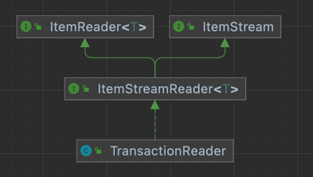

## 잡 중지하기

잡의 중지 사유는 이후 수행 작업에 영향을 준다.

### 1. 자연스러운 완료

모든 스텝이 COMPLETED 됨 → 잡도 COMPLETED 코드 반환

### 2. 프로그래밍 적으로 중지하기

ex. 스탭에서 완료시 무결성검사에 실패?     
잡의 재시작을 위한 새로운 attribute사용 + 플래그 설정을 통한 잡 종료 

#### 중지 트랜지션 (stop transition)

중지 트랜지션으로 중지가능한 잡을 구성 + 재시작 위치를 지정

예제.     
(1) 거래정보 파일(.csv) : 거래내역 + 마지막줄 요약정보(레코드수)      
(2) 거래 테이블 저장 → 계좌 요약 테이블 저장        
(3) 각 계좌의 요약정보 파일 (.csv) 생성     

- (2)를 수행하기전, (1)파일의 거래내역의 수와 요약정보에 대한 데이터 검증이 필요

TransactionReader.java
```java
public class TransactionReader implements ItemStreamReader<Transaction> {
	// ...
	public TransactionReader(ItemStreamReader<FieldSet> fieldSetReader) {
		this.fieldSetReader = fieldSetReader;
	}

	public Transaction read() throws Exception {
		return process(fieldSetReader.read());
	}

	private Transaction process(FieldSet fieldSet) {
		Transaction result = null;

		if(fieldSet != null) {
			if(fieldSet.getFieldCount() > 1) { // 데이터 레코드
				result = new Transaction();
				result.setAccountNumber(fieldSet.readString(0));
				result.setTimestamp(
						fieldSet.readDate(1,
								"yyyy-MM-DD HH:mm:ss"));
				result.setAmount(fieldSet.readDouble(2));

				recordCount++;
			} else { // 푸터 레코드 (요약) - 필드를 하나만 가진다.
				expectedRecordCount = fieldSet.readInt(0);
			}
		}

		return result;
	}

	@AfterStep
	public ExitStatus afterStep(StepExecution execution) {
		if(recordCount == expectedRecordCount) { // 읽은 레코드수와 요약에 작성된 레코드수 비교, 무결성 검증
			return execution.getExitStatus();
		} else {
			return ExitStatus.STOPPED; // 스탭의 ExitStatus가 리더의 상태에 묶임 -> 커스텀 ItemReader가 필요한 이유
		}
	}
	// ..

        // TransactionReader에서 ItemStream을 구현
	@Override
	public void open(ExecutionContext executionContext) throws ItemStreamException {
		this.fieldSetReader.open(executionContext);
	}

	@Override
	public void update(ExecutionContext executionContext) throws ItemStreamException {
		this.fieldSetReader.update(executionContext);
	}

	@Override
	public void close() throws ItemStreamException {
		this.fieldSetReader.close();
	}
}
```



- ItemStream을 구현하지만, 스프링 배치에 명시적으로 등록되지 않음.
- 등록하는 두가지 방법
  1. Job에서 TransactionReader를 명시적으로 ItemStream으로 등록 (직접 기억해서 등록 필요 → 오류 발생 가능성 높음)
  2. TransactionReader에서 ItemStream을 구현 (*7,9장)
    
> ItemReader, ItemProcessor, ItemWriter의 경우      
> 스프링 배치가 ItemStream의 구현체임을 자동으로 확인, 적절한 시점에 콜백이 수행되도록 등록함.

TransactionApplierProcessor.java
```java
public class TransactionApplierProcessor implements
		ItemProcessor<AccountSummary, AccountSummary> {

	private TransactionDao transactionDao; 

	public TransactionApplierProcessor(TransactionDao transactionDao) {
		this.transactionDao = transactionDao;
	}

	public AccountSummary process(AccountSummary summary) throws Exception {
		// DB에서 계좌별 트랜잭션 정보를 가져옴
		List<Transaction> transactions = transactionDao
				.getTransactionsByAccountNumber(summary.getAccountNumber());

		for (Transaction transaction : transactions) {
			summary.setCurrentBalance(summary.getCurrentBalance()
					+ transaction.getAmount());
		}
		return summary;
	}
}
```

커스텀 배치 컴포넌트로 잡을 구성 (TransactionProcessingJob.java) * 소스참고
```java
@EnableBatchProcessing
@SpringBootApplication
public class TransactionProcessingJob {
	// ...
	@Bean
	public Step importTransactionFileStep() {
		return this.stepBuilderFactory.get("importTransactionFileStep")
				.<Transaction, Transaction>chunk(100)
				.reader(transactionReader()) // 파일에서 읽어옴(FlatFileItemReader) + 무결성검증, 7장
				.writer(transactionWriter(null)) // DB에 기록(JdbcBatchItemWriter), 9장
				.allowStartIfComplete(true) // COMPLETED로 끝난 스탭도 재실행 대상에 포함
				.listener(transactionReader()) // 리스너 등록 
				.build();
	}
        // ...

	@Bean
	public Step applyTransactionsStep() {
		return this.stepBuilderFactory.get("applyTransactionsStep")
				.<AccountSummary, AccountSummary>chunk(100)
				.reader(accountSummaryReader(null)) // DB에서 계좌 요약 정보 읽음
				.processor(transactionApplierProcessor()) // 앞 스탭에서 저장한 트랜잭션 정보 + 요약정보에 갱신
				.writer(accountSummaryWriter(null)) // 갱신된 정보 DB에 저장
				.build();
	}
	// ...
    
	@Bean
	public Step generateAccountSummaryStep() {
		return this.stepBuilderFactory.get("generateAccountSummaryStep")
				.<AccountSummary, AccountSummary>chunk(100)
				.reader(accountSummaryReader(null))  // ItemReader재사용, @StepScope로 step마다 독립적. 새로운 인스턴스
				.writer(accountSummaryFileWriter(null)) // 요약정보 파일 생성(FlatFileItemWriter)
				.build();
	}
	// ...

	@Bean
	public Job transactionJob() {
            return this.jobBuilderFactory.get("transactionJob")
                    .start(importTransactionFileStep())
                    .on("STOPPED").stopAndRestart(importTransactionFileStep()) // 무결성 검증 실패시 잡 중지처리
                    .from(importTransactionFileStep()).on("*").to(applyTransactionsStep())
                    .from(applyTransactionsStep()).next(generateAccountSummaryStep())
                    .end() // 트랜지션 API로 잡생성시 end 호출 필요
                    .build();
	}
}
```
- (StepListener + ExitStatus → 수동으로 잡 중지)

#### StepExecution을 사용해 중지하기

- AfterStep → BeforeStep
```java
// TransactionReader.java
public class TransactionReader implements ItemStreamReader<Transaction> {
	// ...
	private Transaction process(FieldSet fieldSet) {
		Transaction result = null;

		if(fieldSet != null) {
			if(fieldSet.getFieldCount() > 1) { // 데이터 레코드
				result = new Transaction();
				result.setAccountNumber(fieldSet.readString(0));
				result.setTimestamp(
						fieldSet.readDate(1,
								"yyyy-MM-DD HH:mm:ss"));
				result.setAmount(fieldSet.readDouble(2));

				recordCount++;
			} else { // 푸터 레코드 (요약) - 필드를 하나만 가진다.
				expectedRecordCount = fieldSet.readInt(0);

				if(expectedRecordCount != this.recordCount) {
					this.stepExecution.setTerminateOnly(); // <<
				}
			}
		}

		return result;
	}
	// ...

	@BeforeStep
	public void beforeStep(StepExecution execution) {
		this.stepExecution = execution;
	}
	// ...
}
    
```

```java
public class TransactionProcessingJob {
	// ...
	@Bean
	public Job transactionJob() {
		return this.jobBuilderFactory.get("transactionJob")
				.preventRestart()
				.start(importTransactionFileStep())
				.next(applyTransactionsStep())
				.next(generateAccountSummaryStep())
				.build();
	}
	// ...
}
```
### 3. 오류처리

- 잡이 중지되면, 현재 청크를 롤백
- 성공된 작업까지 커밋가능, 재시작시 중단 부분 찾을수 있음
- 오류발생시 Step의 ExitStatus.FAILED 임
  - FAILED일 경우 스프링 배치는 중단된 청크부터 스탭을 재실행

ex.     
chunk1(item1, item2, item3, item4, item5)       
chunk2(item1, item2, item3, item4, item5)   
chunk3(item1, item2, item3, item4, item5)   
...     
chunk10(item1, item2, item3, item4, item5)

2번째 chunk의 4번째 item에서 예외발생시     
2번째 chunk의 1~4item 처리는 롤백 + 재시작시 chunk1은 건너뜀
