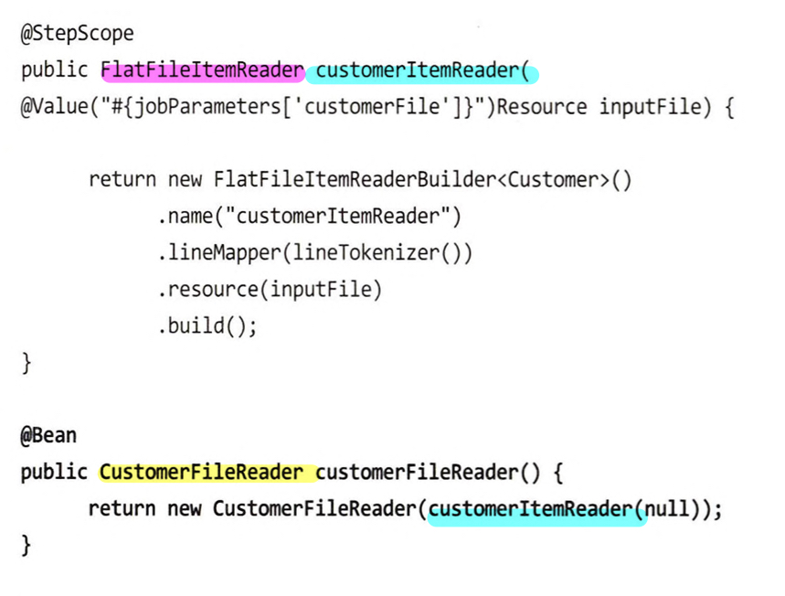

## 여러 가지 레코드 포맷

### 커스텀 LineTokenizer 구현의 문제점
1. 복잡도 : 레코드 수와 포맷이 다양해 질수록 클래스 하나로 감당할 수 없다.
2. 관심사 분리 : 단순히 파싱만 해야 하는데, 레코드 타입 까지 알아야 한다.

### LineMapper의 구현체 
- DefaultLineMapper : LineTokenizer 하나 + FileSetMapper 하나 
- PatternMatchingCompositeLineMapper : 여러 LineTokenizer 로 구성된 Map + 여러 FileSetMapper 로 구성된 Map (전략패턴)

### 1) 여러 줄에 걸친 레코드 - 각각의 아이템으로 


쉼표(,)로 구분된 두가지 포맷(CUST, TRANS)의 레코드
- CUST(고객정보)
- TRANS(거래정보) : 계좌번호, 거래일시, 금액

Transaction.java
```java
public class Transaction {
	private String accountNumber;
	private Date transactionDate;
	private Double amount;
	// getter, setter are omitted
}
```

MultiFileJob.java
```java
...
@Bean
@StepScope
public FlatFileItemReader customerItemReader(
        @Value("#{jobParameters['customerFile']}")Resource inputFile) {

    return new FlatFileItemReaderBuilder<Customer>()
            .name("customerItemReader")
            .lineMapper(lineTokenizer())
            .resource(inputFile)
            .build();
}

@Bean
public PatternMatchingCompositeLineMapper lineTokenizer() {
    Map<String, LineTokenizer> lineTokenizers = new HashMap<>(2);
	
    // LineTokenizer : 레코드 -> FieldSet
    lineTokenizers.put("CUST*", customerLineTokenizer());
    lineTokenizers.put("TRANS*", transactionLineTokenizer());

    Map<String, FieldSetMapper> fieldSetMappers = new HashMap<>(2);

    // FeildSetMapper : FieldSet을 도메인에 매핑
    // - BeanWrapperFieldSetMapper : 프레임워크 제공, 기본 필드만 가능 (Data, Double은 매핑 불가능)
    // - 커스텀 FieldSet : TransactionFieldSetMapper
    BeanWrapperFieldSetMapper<Customer> customerFieldSetMapper =
            new BeanWrapperFieldSetMapper<>();
    customerFieldSetMapper.setTargetType(Customer.class);

    fieldSetMappers.put("CUST*", customerFieldSetMapper);
    fieldSetMappers.put("TRANS*", new TransactionFieldSetMapper());

    PatternMatchingCompositeLineMapper lineMappers =
            new PatternMatchingCompositeLineMapper();

    lineMappers.setTokenizers(lineTokenizers);
    lineMappers.setFieldSetMappers(fieldSetMappers);

    return lineMappers;
}

@Bean
public DelimitedLineTokenizer transactionLineTokenizer() {
    DelimitedLineTokenizer lineTokenizer =
            new DelimitedLineTokenizer();

    lineTokenizer.setNames("prefix",
            "accountNumber",
            "transactionDate",
            "amount");

    return lineTokenizer;
}

@Bean
public DelimitedLineTokenizer customerLineTokenizer() {
    DelimitedLineTokenizer lineTokenizer =
            new DelimitedLineTokenizer();

    lineTokenizer.setNames("firstName",
            "middleInitial",
            "lastName",
            "address",
            "city",
            "state",
            "zipCode");
	
    // prifix, 0번째 인덱스 넘어감
    lineTokenizer.setIncludedFields(1, 2, 3, 4, 5, 6, 7);

    return lineTokenizer;
}
...
```
TransactionFieldSetMapper.java
```java
public class TransactionFieldSetMapper implements FieldSetMapper<Transaction> {

	public Transaction mapFieldSet(FieldSet fieldSet) {
		Transaction trans = new Transaction();

		// readXXX : FieldSet 인터페이스는 String 타입을 XXX 데이터 타입으로 읽어오는 메서드를 제공
		trans.setAccountNumber(fieldSet.readString("accountNumber"));
		trans.setAmount(fieldSet.readDouble("amount"));
		trans.setTransactionDate(fieldSet.readDate("transactionDate",
				"yyyy-MM-dd HH:mm:ss"));

		return trans;
	}
}
```


### 2) 여러 줄에 걸친 레코드 - 단일 아이템으로
: TRANS는 바로 앞에 나온 CUST의 거래내역으로, Customer내부에 Transaction객체의 컬랙션을 가지는 것이 맞음

- footer(=trailer) : 레코드가 끝나는 부분 - 스프링배치 공식 예제는 이걸 사용하지만, 실제 데이터는 푸터 레코드가 없는경우가 많다.
- 예제의 경우 다음줄을 읽어야만 끝임을 알 수 있음.


customFileReader를 통해 끝임을 판단함.
- CustomerFileReader 에서 Customer객체를 읽었는지 판단
  - 읽지 않았다면, FlatFileItemReader에서 레코드 하나를 읽음
  - 읽었다면, Customer객체 내부 거래내역 List를 초기화 -> 레코드가 Transaction이면 이를 추가

Customer.java
```java
public class Customer {
	// ... 
	// List<Transaction> 추가
	private List<Transaction> transactions;
	// ...
}
```
CustomerItemReader.java
```java
public class CustomerFileReader implements ItemStreamReader<Customer> {

      private Object curItem = null;
    
      private ItemStreamReader<Object> delegate;
    
      public CustomerFileReader(ItemStreamReader<Object> delegate) {
            this.delegate = delegate;
      }
    
      //  -- read *제어 중지 로직(control break logic)
      // 파일에서 고객 레코드를 읽음
      // 다음 고객 레코드를 만나기 전까지 현재 고객의 거래 내역을 한줄씩 읽음
      // 다음 고객 발견시 ItemReader로 반환
      public Customer read() throws Exception {
            if(curItem == null) {
              curItem = delegate.read();
            }
			
            Customer item = (Customer) curItem;
            curItem = null;
        
            if(item != null) {
                item.setTransactions(new ArrayList<>());
                while(peek() instanceof Transaction) {
                    item.getTransactions().add((Transaction) curItem);
                    curItem = null;
                }
            }
        
            return item;
      }
    
      // -- peek
      // 현재 레코드를 캐시(curItem)에 저장
      // 레코드를 읽었지만 처리 하지 않았다면, 동일 레코드 반환 (처리여부 판단 - null(=처리됨))
      private Object peek() throws Exception {
            if (curItem == null) {
              curItem = delegate.read();
            }
            return curItem;
      }
    
      public void close() throws ItemStreamException {
                delegate.close();
      }
    
      public void open(ExecutionContext arg0) throws ItemStreamException {
                delegate.open(arg0);
      }
    
      public void update(ExecutionContext arg0) throws ItemStreamException {
                delegate.update(arg0);
      }
    
}


```
- ItemReader 인터페이스를 구현하지 않음
  - ItemReader 구현체 사용시, 읽을 대상 리소스를 열고/ 닫는것 제어 + 읽은 레코드 관련 상태 => ExecutionContext에서 관리 
- ItemStreamReader 인터페이스를 구현
  - 리소스 관리를 직접해야함
  - 아래 처럼 ItemReader(FlatFileItemReader) 를 래핑한 커스텀 ItemReader(CustomerFileReader) 를 사용하면, ItemReader가 리소스 관리를 한다.



- CustomerFileReader를 구성하려면 위임(delegate) 객체의 의존성이 하나 필요하다.
  - private ItemStreamReader\<Object\> delegate
  - 실제로 파일을 읽고 파싱하는 리더
- copyFileStep 의 read(customerFileReader()) 변경


### 3) 여러개의 소스
- MultiResourceItemReader 
  - ItemReader를 래핑함. 
  - 그러나 리소스를 정의하는 일을 ItemReader에 맡기지 않음.
  - 읽어야할 파일명의 패턴을 MultiResourceItemReader 의존성으로 정의함.

- 
  - private ResourceAwareItemReaderItemStream<Object> delegate;
- sdasadsafdsafds

```java
@Bean
@StepScope
public MultiResourceItemReader multiCustomerReader(@Value("#{jobParameters['customerFile']}")Resource[] inputFiles) {
    return new MultiResourceItemReaderBuilder<>()
            // 1. 다른 ItemReader 구현체 처럼 Stateful하기 때문에  
            .name("multiCustomerReader")
            // 2. 읽어들여야 할 파일 목록
            .resources(inputFiles)
            // 3. 작업을 위임할 컴포넌트
            .delegate(customerFileReader())
            .build();
}

@Bean
@StepScope
public FlatFileItemReader customerItemReader() {
    return new FlatFileItemReaderBuilder<Customer>()
    .name("customerItemReader")
    .lineMapper(lineTokenizer())
    //.resource(inputFile) -> MultiResourceItemReader에서 resource를 가짐
    .build();
}
```

- 단일 파일예제 - CustomerFileReader 는 ItemStreamReader 인터페이스를 구현 + 위임 컴포넌트 타입으로도 사용
- ItemStreamResource의 하위 인터페이스 중 하나 사용
  - ResourceAwareItemReaderItemStream 인터페이스의 목적은 리소스에서 입력을 읽는 모든 ItemReader를 지원
  - ItemReader에 복수 개의 Resource를 주입하게 하기 위함

- ItemStreamReader -> ResourceAwareItemReaderItemStream

```java
public class CustomerFileReader implements ResourceAwareItemReaderItemStream<Customer> {
    // ...
    private ResourceAwareItemReaderItemStream<Object> delegate;

    public CustomerFileReader(ResourceAwareItemReaderItemStream<Object> delegate) {
        this.delegate = delegate;
    }  
    // ...
    // resource주입능력!
    // - ItemReader가 스스로 파일 관리하는 대신 필요한 각 파일을 스프링 배치가 생성해 ItemReader에 주입가능
    @Override
    public void setResource(Resource resource) {
          this.delegate.setResource(resource);
    }
    // ...
}
```
- 여러개의 파일을 다룰경우, 재시작 같은 상황에서 스프링 배치가 안전장치를 제공하지 않는다.
- file1.csv -> file2.csv -> file3.csv
  - file2.csv 에서 에러 발생
  - 재시작 전에 file4.csv 파일을 추가
  - 이슈 : 잡 실행시에 4번 파일은 없었음에도 다시 시작하는 잡은 4번 파일도 실행대상으로 판단한다.
  - 방지방안 : 일반적으로 각 배치 실행시 디렉터리를 별도로 생성. 새로운 파일은 새 디렉터리에

## XML
- 플랫파일의 경우 메타데이터가 없어서, 레코드 포맷 정보가 많이 필요했음
- 반면, XML의 경우 태그를 사용해 데이터를 완벽히 설명함

### XML 파서

- DOM parser 
  - 노드를 탐색할 수 있도록 전체 파일을 메모리에 트리구조로 읽음
  - 이는 성능 부하를 발생 -> 배치처리에 적합하지 않음
- SAX parser**
  - 특정 엘리먼트를 만나면 이벤트를 발생시키는 이벤트 기반 파서
  - 배치에 적합

스프링 배치는 StAX 파서를 사용한다.
- StAX도 이벤트 기반 파서임
- XML문서내 각 섹션을 독립적으로 파싱하는 기능을 제공하는 장점을 가짐
- 한번에 처리할 아이템 (섹션) 을 나눔 

```xml
<customers>
    <customer>
    <firstName>Michael</firstName>
    <middleInitial>T</middleInitial>
    <lastName>Buffett</lastName>
    <address>8192 Wall Street</address> 
    <city>Omaha</city>
    <state>NE</state>
    <zipCode>25372</zipCode>
    <transactions>
        <transaction>
            <accountNumber>8179238</accountNumber>
            <transactionDate>2010-10-27 05:56:59</transactionDate>
            <amount>-91.76</amount>
        </transaction> 
        <transaction>
            <accountNumber>8179238</accountNumber>
            <transactionDate>2010-10-06 21:51:05</transactionDate>
            <amount>-25.99</amount>
        </transaction> 
    </transactions>
    </customer>
  <!-- ... -->
</customers>
```

- 사용자가 정의한 XML fragment를 도메인 객체로 파싱
- XML fragment : 시작~종료 태그 까지 XML 블록

StaxEventItemReader : XML fragment의 루트 엘리먼트 이름 정의 - XML 내에서 아이템으로 취급

Unmarshaller : XML -> 도메인 객체 

XmlJob.java
```java
...
@Bean
@StepScope
public StaxEventItemReader<Customer> customerFileReader(
        @Value("#{jobParameters['customerFile']}") Resource inputFile) {

    return new StaxEventItemReaderBuilder<Customer>()
            .name("customerFileReader")
            .resource(inputFile)
            .addFragmentRootElements("customer")
            .unmarshaller(customerMarshaller())
            .build();
}
...
```

스프링 배치에서 제공하는 XML 바인딩 구현체
- Castor, JAXB, JiBX, XML, Beans, XStream 구현체
- 예제 - JAXB : JaxbMarshaller 구현체 (의존성 등록필요 295p)

1. JAXB 어노테이션 추가
```java
@XmlRootElement
public class Customer { 
	...

    @XmlElementWrapper(name="transactions")
    @XmlElement(name="transaction")
    public void setTransaction(List<Transaction> transactions) {
		this.transactions = transactions;
    }
    ...
}

@XmlType(name="transaction")
public class Transaction { ... }
```

2. 언마샬러 구성
```java
@Bean
public Jaxb2Marshaller customerMarshaller() {
    Jaxb2Marshaller jaxb2Marshaller = new Jaxb2Marshaller();

    jaxb2Marshaller.setClassesToBeBound(Customer.class, Transaction.class);

    return jaxb2Marshaller;
}
```

3. step의 ItemReader를 입력 소스로 사용 : .reader(customerFileReader(null))

## JSON
JsonObjectReader 인터페이스의 구현체
- Jackson 파싱 엔진(예제)
- Gson 파싱 엔진

```java
@Bean
@StepScope
public JsonItemReader<Customer> customerFileReader(
        @Value("#{jobParameters['customerFile']}") Resource inputFile) {

    // ObjectMapper - Jacksondl JSON을 읽고 쓰는데 사용하는 주요 클래스
    ObjectMapper objectMapper = new ObjectMapper();
    objectMapper.setDateFormat(new SimpleDateFormat("yyyy-MM-dd hh:mm:ss"));

    // JacksonJsonObjectReader
    // 두가지 의존성을 가짐. 1) 반환할 클래스 ex.Customer 2) ObjectMapper 인스턴스 
    JacksonJsonObjectReader<Customer> jsonObjectReader = new JacksonJsonObjectReader<>(Customer.class);
    jsonObjectReader.setMapper(objectMapper);

    //  JsonItemReader 구성 빌더 사용
    return new JsonItemReaderBuilder<Customer>()
            // 1) 배치 재시작시 사용되는 배치이름
            .name("customerFileReader")
            // 2) 파싱에 사용될 JsonObjectReader
            .jsonObjectReader(jsonObjectReader)
            // 3) 읽을 리소스
            .resource(inputFile)
            // strict - 입력이 반드시 존재해야 하나 여부 default: true
            // saveState - 상태를 저장해야 하는지 여부 default: true
            // 현재의 ItemCount - 재시작에사용
            .build();
}
```
