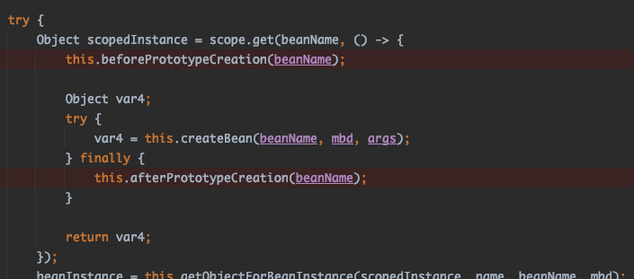

## ItemReader

청크기반 스텝의 구성요소로 ItemReader, ItemProcessor, ItemWriter 가 있다.   
스프링 배치에서는 ItemReader 인터페이스를 이용하여 플랫파일, xml, 데이터베이스 등의 외부 데이터를 읽어서 처리할 수 있도록 한다.

ex. org.springframework.batch.item 하위에 존재하는 패키지들.. (플랫파일은 file 패키지에 존재)


ItemReader 의 인터페이스
```java
package org.springframework.batch.item;

import org.springframework.lang.Nullable;

public interface ItemReader<T> {
    @Nullable
    T read() throws Exception, UnexpectedInputException, ParseException, NonTransientResourceException;
}
```

> step -> read 메서드 호출 -> step 이 처리할 아이템 한개 반환 -> step 은 청크 내 데이터가 몇개 처리 되었는지 관리
>

---

### 플랫 파일

플랫파일은 xml 등과 같은 파일과는 다르게 파일의 포맷이나 의미가 별도로 존재하지 않는다.


다음으로 FlatFileItemReader 클래스를 이용해 플랫파일의 데이터를 읽어오는 몇가지 방법을 살펴본다.

- 고정 너비 파일
- 필드가 구분자로 구분된 파일
- 커스텀 레코드 파싱

#### 고정 너비 파일

고정 너비 파일은 파일의 구분자가 없는 대신 데이터간의 너비 간격을 통해 구분한다.


> 원본 파일 위치.  
> https://github.com/Apress/def-guide-spring-batch/blob/master/Chapter07/src/main/resources/input/customerFixedWidth.txt
> 

위 데이터를 처리하기 위한 job, step, itemwriter, domain 클래스는 아래와 같다.   
지금까지 살펴본 구조에서 특별한것 없이 간단하다.

job
```java
    @Bean
    public Job job() {
        return this.jobBuilderFactory.get("fixedWidthJob")
                .start(copyFileStep())
                .build();
    }
```

step
```java
    @Bean
    public Step copyFileStep() {
        return this.stepBuilderFactory.get("copyFileStep")
                .<Customer, Customer>chunk(10)
                .reader(customerItemReader(null))
                .writer(itemWriter())
                .build();
    }
```

item writer
```java
    @Bean
    public ItemWriter<Customer> itemWriter() {
        return (items) -> items.forEach(System.out::println);
    }
```

domain
```java
public class Customer {
    private String firstName;
    private String middleInitial;
    private String lastName;
    private String addressNumber;
    private String street;
    private String city;
    private String state;
    private String zipCode;
 ...
```


아래에 살펴볼 코드가 아이템을 읽는 실질적인 코드이다.   
customerItemReader() 메소드

```java
    @Bean
    @StepScope // jobParameters 를 사용하는 경우 StepScope 정의가 필요하다. 
    public FlatFileItemReader<Customer> customerItemReader(
            @Value("#{jobParameters['customerFile']}") Resource inputFile
    ) {

        return new FlatFileItemReaderBuilder<Customer>()
                .name("customerItemReader")
                .resource(inputFile)
                .fixedLength()
                .columns(new Range[]{
                        new Range(1,11), new Range(12, 12), new Range(13, 22),
						new Range(23, 26), new Range(27,46), new Range(47,62), new Range(63,64),
						new Range(65,69)
                })
                .names("firstName", "middleInitial", "lastName", "addressNumber", "street", "city", "state","zipCode")
                .targetType(Customer.class)
                .build();
    }
```

대충 코드들을 보면 어떻게 동작하는지 추측 가능하고 어렵지 않게 이해할 수 있다.   
jobParamters 로 실제 읽어들일 파일을 받아와서 columns 와 names 를 통해 매핑한 결과를 Customer 도메인 객체로 만들고, 그 결과를 itemWriter 로 보낸다..

책에서는 클래스이름과 함께 이론적인 설명들이 써있어서 관련 내용과 함께 위 코드를 보고 생긴 의문에 대해서도 살펴보자.

1. @StepScope 는 왜 추가하였는가?
2. 실제 파일을 inputFile 파라미터로 어떻게 받아오는가?
3. name 은 왜 필요한가?
4. fixedLegth() 메소드는 중간에 무슨 역할을 하는가?
5. targetType() 메소드는 무슨 역할을 하는가?
6. 위 결과로 읽어낸 데이터를 어떻게 itemWriter 에서 사용하는가?

> columns(), names() 메소드는 그냥 add 하는거 밖에 없어서 뺌.

##### 1. @StepScope 는 왜 추가하였는가?

4장의 설명에서 이미 나왔는데 기억을 못했었음.. 다시 읽어보니 jobParameters 를 사용하려면 늦은 바인딩을 이용해야 한다고 한다.

그리고 저번주에 처음 앱 기동 시점에 beanFactory 에 @Bean 이 붙어있는 메소드들을 찾아다가 한번씩 모두 get 하는것을 확인했었다. 

AbstractBeanFactory 클래스에 doGetBean() 메소드에 아래와 같은 코드가 있음.
```java
if (mbd.isSingleton()) {
                    sharedInstance = this.getSingleton(beanName, () -> {
                        try {
                            return this.createBean(beanName, mbd, args);
                        } catch (BeansException var5) {
                            this.destroySingleton(beanName);
                            throw var5;
                        }
                    });
                    beanInstance = this.getObjectForBeanInstance(sharedInstance, name, beanName, mbd);
                }
```

this.createBean() 메소드에서 빈과 파라미터를 매핑하는 관련 코드가 있는데 엄청 복잡...

빈을 한번씩 호출하는 시점에는 jobParameters 파라미터가 없으니 당연히 에러가 나는것이다.   
> ...Unsatisfied dependency expressed through method 'customerItemReader' parameter 0;...
> 

저번주 책을 보면(6장 잡실행하기) 잡이 실행되는 시점에 (SpringApplication 의 callRuners) 로 잡 파라미터 세팅 등이 먼저 완료되어야 하는데 그전에 앱 구동 시점에 get bean 을 해버리니 에러가 날 수 밖에 없다.

그럼 @StepScope 를 추가하면 어떻게 빈 등록 시점에 호출되지 않는건가?

@StepScope 를 보면 아래와 같다.

```java
@Scope(
    value = "step",
    proxyMode = ScopedProxyMode.TARGET_CLASS
)
@Retention(RetentionPolicy.RUNTIME)
@Documented
public @interface StepScope {
}
```

@Scope 어노테이션이 의심된다. 뭘까

Scope 는 우리가 사용하려는 빈을 등록하는 시점과 제거하는 시점과 같이 유효한 시점을 정의할때 사용한다.   
어떤 블로그에 해석해논 표가 있어서 들고옴..


> 원본 문서 https://docs.spring.io/spring-framework/docs/4.2.5.RELEASE/spring-framework-reference/html/beans.html#beans-factory-scopes. 
> 

기본적으로 모든 bean 은 singleton 으로 생성된다. (즉, 앱 구동 시점에 빈 하나만 정의되서 사용된다.)

그럼 위에 StepScope 가 무엇인지 예측해볼 수 있다.    
해당 "step" scope 은 배치쪽에서 제공하는 scope 으로 @StepScope 어노테이션이 붙어있는 step 이 실행되는 시점에 인스턴스가 생성되고 (빈 생성) step 이 끝나면 빈이 제거된다.

해당 step 빈이 실행되는 시점에는 이미 잡 파라미터 세팅 등, 잡 구동에 필요한 환경 준비(jobParameters..)가 완료되므로 문제없이 실행된다.

##### 2. 실제 파일을 inputFile 파라미터로 어떻게 받아오는가?

> 결과적으로 FlatFileItemReaderBuilder 클래스 내부에 FlatFileItemReader 에서 한줄씩 읽고 있으나 조금 따라가보면...

SpringApplication 의 callRunner 메소드가 실행되고 나면 JobLauncherApplicationRunner 클래스의 run() 메소드가 실행된다.

args 로 부터 jobArguments 변수를 할당하고 run 메소드의 파라미터로 세팅한다.


jobParameters 변수에 세팅한다.   
이때까지는 아직 우리가 예전부터 봐왔던 jobParametersBuilder 에 key, value 로 파라미터 세팅하는것과 똑같음.   
JobParametersBuilder propertiesBuilder = new JobParametersBuilder(); 했던거...


JobParameters 에는 LinkedHashMap 으로 아래 2가지 값이 담겨서 사용된다.


그 후 job.execute() 메서드가 호출되면서 잡런처가 run 하게 되면, 아까 위에서 봤었던 scope 관련...
빈이 생성되는 로직이 실행된다..


AbstractBeanFactory 클래스의 mbd 는 beanName 으로 bean 정보를 가져온것이고, (mergedLocalBeanDefinition() 메소드 결과임).  
mbd 정보 로부터 해당 빈이 singleton, prototype 인지 체크하는 부분 건너뛰고 else 문에서 로직이 실행되는것을 볼 수 있다. ("step" 이기 때문..)


빈 생성하는 로직을 확인할 수 있다.



빈 생성 완료 후.. step 내 FlatFileItemReaderBuilder 클래스가 실행되면서 doOpen() 메소드가 실행되고,   
(this.resource 는 item reader build() 시점에 할당됨)


DefaultBufferedReaderFactory 클래스에서는 우리가 읽을 resource 를 byte 단위로 파일을 읽어오도록 한다.    
위 코드 다시보면 this.reader 에 할당되는것을 볼 수 있는데 이제 read() 메서드가 호출될때마다 저 this.reader 를 사용하게 된다.


##### 3. name 은 왜 필요한가?

name 필드는 saveState 필드 때문에 필요하다고 한다.   
예전에 살펴봤듯이 saveState 는 아이템 읽기 실패 시 실패한 지점부터 다시 데이터를 읽을 수 있도록 제공하는 필드였다.

batch_step_execution_context 테이블에 reader 의 상태를 저장하기 위한 접두어로 사용된다고 한다.  


> default 값은 true   
> 병렬 실행 시 해당 값은 false 로 하는게 좋다는것을 살펴 봤었다.   
> 1번째 스레드에서는 1~3번까지 데이터를 읽다가 2번에서 실패함. 그런데 동시에 2번째 스레드에서는 4~7번을 정상적으로 읽었다면 saveState=true 에 의해서 7번까지 정상적으로 데이터를 읽었다고 판단한다고 한다. 

만약 saveState 를 사용하지 않는다면 굳이 name 이 필요없다고 한다.

name 필드를 주석 처리하고 실행해보면, saveState 필드가 true 이니 name 필드가 필요하다고 나온다.


그럼 saveState 를 false 로 바꾸고 실행하면 batch_step_execution_context 테이블에 데이터가 저장되지 않는건가?

아래 처럼 false 로 설정하고 실행하니, 데이터도 정상적으로 읽어오고 있고 해당 테이블에 데이터는 생성되지만 데이터내에 
reader 의 상태 저장에 사용되는듯한 데이터가 보이지 않는다.

> {"@class":"java.util.HashMap","batch.taskletType":"org.springframework.batch.core.step.item.ChunkOrientedTasklet","batch.stepType":"org.springframework.batch.core.step.tasklet.TaskletStep"}


그럼 saveState 가 true 일때 어떻게 executionContext 로 마지막에 읽은 부분을 체크하고 재실행하는가?

먼저 성공했을때 {name}.read.count: 1000 개이다.   


batch_job_execution 도 실패로 바꾸고,   
batch_step_execution 테이블에 status: failed, commit_count:0, read_count:5, write_count:5 등등 바꾸고
batch_step_execution_context 테이블에 해당 값을 임의로 5로 바꾸면 5번째 부터 읽는지 확인해보자.  

 
 

아래 데이터중에 예상대로라면 5번째인 "Stuart" 부터 읽어야 한다.


아래 콘솔을 보면 5번째(Stuart) 부터 읽는것을 확인할 수 있다.


그럼 saveState 필드는 정확히 어떤 테이블에, 어떤 데이터를 읽어가는건가?
batch_step_execution 필드에 commit_count, write_count 도 있고,
batch_step_execution_context 필드에 데이터중에 {name}.read.count 가 있었다.

결론 먼저 얘기하면 batch_step_execution_context 필드에 read.count 로 읽어온다.


책의 예제로 사용한 FlatFileItemReader 클래스는 AbstractItemCountingItemStreamItemReader 클래스를 상속받아서 사용하고 있는데, 해당 클래스의 open() 메소드에서 처리하고 있다.
> saveState 필드도 해당 클래스에서 true 로 세팅되어 있음.


##### 4. fixedLegth() 메소드는 중간에 무슨 역할을 하는가?

```java
return new FlatFileItemReaderBuilder<Customer>()
                .name("customerItemReader123")
                .resource(inputFile)
                .fixedLength() 
                .columns(new Range[]{
                        new Range(1,11), new Range(12, 12), new Range(13, 22),
                        new Range(23, 26), new Range(27,46), new Range(47,62), new Range(63,64),
                        new Range(65,69)
                })
                .names("firstName", "middleInitial", "lastName", "addressNumber", "street", "city", "state","zipCode")
                .targetType(Customer.class)
                .build();
```

fixedLength() 빌더 메소드를 추가하면 FlatFileItemReaderBuilder 클래스에서 
fixedLengthBuilder 클래스 인스턴스를 생성해서 리턴한다.

```java
public FlatFileItemReaderBuilder.FixedLengthBuilder<T> fixedLength() {
        this.fixedLengthBuilder = new FlatFileItemReaderBuilder.FixedLengthBuilder(this);
        this.updateTokenizerValidation(this.fixedLengthBuilder, 2);
        return this.fixedLengthBuilder;
    }
```

해당 클래스는 itemeader build() 시에 사용된다.


DefaultLineMapper() 클래스에 setLineTokenizer() 메소드 호출 시 해당 클래스의 빌드한 결과를 할당하고 있다.

참고로 DefaultLineMapper() 클래스는 LineTokenizer, FieldSetMapper 변수를 가지고 있고 


this.fixedLengthBuilder.build() 를 들어가보면
names(), columns() 를 tokenizer 에 세팅하는걸 볼 수 있다.   
해당 토크나이저는 추후 FlatFileItemReader 에서 read 할때 사용된다.
(read 할때 resource 파일 내용을 tokenize 할때 사용함.)


무슨 역할을 할까?

FlatFileItemReaderBuilder 클래스를 build() 하는 메소드 내부에는 FlatFileItemReader 를 세팅해서 리턴하는 부분이 존재한다.


FlatFileItemReader 클래스의 doOpen() 메소드가 호출되면 파라미터로 전달받은 리소스를 읽을수 있도록 bufferedReader 클래스를 이용한다.


그 후에 위에서 살펴본 마지막까지 실행된 read.count 가 있는지 체크하고,    
FlatFileItemReader 클래스의 doRead() 메소드가 호출되는데,   
이때 보이는 this.lineMapper 가 위에서 살펴봤던 DefaultLineMapper 이다.


this.fieldSetMapper, this.tokenizer 를 보면 아까 세팅한 값이 존재하는걸 확인할 수 있다.   
코드 더 들어가서 실제 자르는 부분은 생략함.


FixedLengthTokenizer 클래스의 tokenize() 메소드에서   
ranges 를 가지고 와서 start 부터 end 까지 자름.   
아래 메소드의 바깥쪽에서 names 를 가지고 매핑하는 코드도 존재하지만 생략..


##### 5. targetType() 메소드는 무슨 역할을 하는가?

예상하다시피 읽어온 데이터를 Customer 객체로 변환하는 역할을 한다.
대충 살펴보면 FlatFileItemReaderBuilder 클래스에 build() 내용중에 BeanWrapperFieldSetMapper 클래스에 setTargetType() 하는 부분이 있다.


그리고 FlatFileItemReader 에서 item 들을 read 할때 (DefaultLineMapper 클래스를 사용한다고 했었다.)


DefaultLineMapper 클래스에 mapLine() 이 호출되는데 해당 메소드내에서는 또 BeanWrapperFieldSetMapper 클래스의 mapFieldSet() 메소드를 호출한다.


getBean() 메소드에서 할단된 type 을 인스턴스로 만들어서 리턴하고, (Customer.class)   
아래 부분의 코드내에서 읽어온 데이터를 Customer 클래스에 바인딩 처리를 진행한다.
(binder.bind())

##### 6. 위 결과로 읽어낸 데이터를 어떻게 itemWriter 에서 사용하는가?

step 을 설정하는 코드를 보면 chunk() 빌더 메소드를 호출한다.   
해당 빌더 메소드를 사용하는 경우 빌더 클래스에서는 SimpleStepBuilder 클래스를 사용하도록 리턴한다.  


SimpleStepBuilder 클래스가 상속중인 AbstractTaskletStepBuilder 클래스가 있는데 해당 클래스 내부에
.build() 메소드가 존재한다.   
그리고 TaskletStep() 메소드로 인스턴스를 생성해서 사용하도록 되어 있다.


메소드 내부에 tasklet 을 세팅하는 부분이 존재하는데, createTasklet() 메소드를 보면
chunkProvider, chunkProcessor 변수를 생성하고 ChunkOrientedTasklet() 클래스를 생성한다.   
(변수 생성 시 step 빌더에서 전달된 getReader(), getProcessor(), getWriter() 를 같이 사용하는것을 볼 수 있다.)


대충.. 위와 같은 과정을 거쳐서 생성된 배치 컴포넌트들은 다시 job의 build(), job 의 run() 을 거쳐서...   
AbstractStep 클래스의 this.open(), this.doExecute() 를 호출하게 된다.


this.open() 호출로 인해 FlatFileItemReader 클래스의 doOpen() 메소드가 실행되고, 파일로 받아온 리소스를 this.reader 변수에 할당한다.
> this.reader 는 우리가 itemReader 로써 계속 읽을 데이터다.

this.doExecute() 메소드가 호출되므로써 reader 에서 아이템이 읽어지고, writer 에서 아이템이 쓰여지기 위한 메서드들이 호출된다.


잘 안보이는데.. AbstractStep 클래스의 doExecute() 메소드가 호출되면 TaskletStep 클래스의 doExecute() 가 호출된다.   (위코드는 TaskletStep 의 doExecute() 메소드다)    
TransactionTemplate 클래스의 execute() 메서드가 실행되고, 
메소드를 쭉.. 따라가다보면 위에서 createdTasklet() 메소드에서 생성했던 ChunkOriendtedTasklet 클래스를 다시 보게 된다.


조금 위에서 chunkProvider 는 getReader() 를 할당했었고, chunkProcessor 는 getWriter() 를 할당했었다.   
예상대로 해당 코드의 provide(), process() 가 예상하는대로 read(), write() 하는 역할을 한다.


#### 필드가 구분자로 구분된 파일

아래와 같이 쉼표(,) 로 구분된 파일을 읽는 방법에 대해 소개한다.


```java
@Bean
    @StepScope
    public FlatFileItemReader<Customer> customerItemReader(
            @Value("#{jobParameters['customerFile']}") Resource inputFile
    ) {

        return new FlatFileItemReaderBuilder<Customer>()
                .name("customerItemReader123")
                .delimited()
                .names("firstName", "middleInitial", "lastName", "addressNumber", "street", "city", "state","zipCode")
                .targetType(Customer.class)
                .resource(inputFile)
                .build();
    }
```

다른점은 fixedLength() 메소드를 delimited() 로 바꿨고 columns() 빌더 메소드를 제거했다.
> columns() 메소드는 어디서부터 어디까지 자를지 range 값을 담는 메소드였다. csv 는 , 쉼표로 구분되기 때문에 필요없음.


위 코드는 FlatFileItemReaderBuilder 클래스의 build() 메소드 내부이다. 

> DefaultLineMapper 클래스에 lineTokenizer 를 set 할때   
> fixedLength() 는 FixedLengthTokenizer 클래스를 사용했고 (this.fixedLengthBuilder.build()),    
> delimited() 는 DelimitedLineTokenizer 클래스를 사용한다. (this.delimitedBuilder.build())   

아이템을 읽는 클래스인 FlatFileItemReader 에서 read 할때 아래와 같이 DelimetedLineTokenizer 클래스의 doTokenizer() 메소드가 실행되고,
라인을 디폴트 delimiter 인 "," 로 자른다.


---

fieldSetMapper 는 읽은 데이터를 필드에 매핑하는 역할을 한다.   
책에서 Customer 클래스를 커스텀하게 변경하는 방법을 소개한다.   

fieldSetMapper 빌더 메소드에 Customer 클래스 대신 사용할 클래스를 추가하면 된다.
> 기존 targetType 은 필요 없어졌다.

```java
return new FlatFileItemReaderBuilder<Customer>()
                .name("customerItemReader123")
                .delimited()
                .names("firstName", "middleInitial", "lastName", "addressNumber", "street", "city", "state","zipCode")
                .fieldSetMapper(new CustomerFieldSetMapper())
                .resource(inputFile)
                .build();
```

아래와 같이 addresNumber 필드에 street 데이터 까지 같이 매핑한다.

```java
public class CustomerFieldSetMapper implements FieldSetMapper<Customer> {
    @Override
    public Customer mapFieldSet(FieldSet fieldSet) throws BindException {
        Customer customer = new Customer();

        customer.setAddressNumber(fieldSet.readString("addressNumber") + "" + fieldSet.readString("street"));
        customer.setCity(fieldSet.readString("city"));
        customer.setFirstName(fieldSet.readString("firstName"));
        customer.setLastName(fieldSet.readString("lastName"));
        customer.setMiddleInitial(fieldSet.readString("middleInitial"));
        customer.setState(fieldSet.readString("state"));
        customer.setZipCode(fieldSet.readString("zipCode"));

        return customer;
    }
}
```

결과는 아래와 같다.


#### 커스텀 레코드 파싱

위 결과를 다른 방식으로 작업해본다.   
위에서는 fieldSetMapper 를 새로 구현해서 필드를 원하는 객체에 매핑하도록 작업했었다.

이번에는 lineTokenizer 를 새로 구현해서 객체에 매핑되기전에 필드 자체를 커스텀하게 바꿔본다.

```java
    @Bean
    @StepScope
    public FlatFileItemReader<Customer> customerItemReader(
            @Value("#{jobParameters['customerFile']}") Resource inputFile
    ) {

        return new FlatFileItemReaderBuilder<Customer>()
                .name("customerItemReader123")
                .lineTokenizer(new CustomerLineTokenizer())
                .targetType(Customer.class)
                .resource(inputFile)
                .build();
    }
```

위 예제 스텝과 다른점은 lineTokenizer() 빌더 메소드와 targetType() 빌더 메소드를 추가했다.

간단히 아이템을 파싱하는 방법에는 delimited, fixedLength, custom 3가지 방법이 있는것으로 보인다.


아래 코드는 CustomerLineTokenizer 클래스의 코드다.

```java
public class CustomerLineTokenizer implements LineTokenizer {

    private String[] names = new String[] {
            "firstName", "middleInitial", "lastName", "addressNumber", "city", "state","zipCode"
    };

    private String delimiter = ",";

    private FieldSetFactory fieldSetFactory = new DefaultFieldSetFactory();

    @Override
    public FieldSet tokenize(String s) {

        String[] fields = s.split(delimiter);

        List<String> parsedFields = new ArrayList<>();

        for(int i=0; i<fields.length; i++) {
            if(i==4) {
                parsedFields.set(i-1, parsedFields.get(i-1) + " " + fields[i]);
            } else {
                parsedFields.add(fields[i]);
            }
        }

        return fieldSetFactory.create(parsedFields.toArray(new String[0]), names);
    }
}
```

위 코드는 단순히 아래와 같다.

1. Aimee,C,Hoover,7341,Vel Avenue,Mobile,AL,35928
2. , 으로 짤라서 배열에 넣고 반복문을 돌린다.
3. 5번째 데이터일때 (Vel Avenue) 이전 데이터 (7341) 와 함께 set 한다.
4. fieldSetFactory 클래스로부터 FieldSet 을 생성해서 리턴한다.

이렇게 만들어진 FieldSet 은 BeanWrapperFieldSetMapper 클래스에 의해 필드가 매핑된다.

> 위에서 살펴봤듯 FlatFileItemReaderBuilder 클래스의 build() 메소드에서 DefaultLineMapper 클래스의 인스턴스를 생성했었고,   
>  해당 인스턴스의 mapper 로 BeanWrappterFieldSetMapper 인스턴스를 매개변수로 주는 부분이 존재했었다.
> 


> tokenize() 한 결과를 mapFieldSet() 메소드의 binder.bind() 메소드에 의해 Customer 객체에 매핑된다.


실행 결과는 위의 결과와 동일함.

