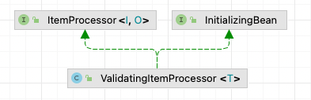

## ItemProcessor

> 작업을 수행하는 컴포넌트.     
> 대부분 ItemReader가 읽은 아이템을 ItemWriter가 쓰기 처리를 하지 않도록 필터링 하는 기능을 함.

- 스프링 배치에서 제공하는 구현체 : ItemProcessorAdapter
- 대부분 구현체를 직접개발

---

- 입력의 유효성 검증
  - 이전 버전에서느 ItemReader에서 유효성 검증 처리 (ValidatingItemReader)
  - 스프링 배치에서 ValidatingItemReader를 서브클래싱 하지 않아, 바로 사용이 어려움
- 기존 서비스의 재사용
  - ItemReaderAdapter -> ItemProcessorAdapter 
- 스크립트 실행
  - ScriptItemProcessor : 스크립트의 입력으로 아이템을 제공하고 출력값을 반환값으로 가져옴
- ItemProcessor 체인
  - 동일 트랜잭션 내 단일 아이템으로 여러 작업을 수행시, 
  - 단일 클래스 처리 커스텀 ItemProcessor (개발로직이 프레임워크에 강한 결합) 대신, 순서대로 실행하는 목록을 만들도록 제공

## ItemProcessor 인터페이스
```java
public interface ItemProcessor<I, O> {
    @Nullable
    O process(I var1) throws Exception;
}
```
- ItemReader가 읽은 아이템을 전달받아 특정 처리후 결과 아이템 반환
- I, O : 입력과 결과 아이템의 타입이 같지 않아도 됨
- null반환시 해당 아이템의 이후 모든 처리가 중지 (다른 아이템의 처리는 정상 진행.)

> ItemProcessor는 멱등(idempotent) 이어야 한다. 아이템은 내결함성(fault tolerant) 시나리오에서 두번 이상 전달될 수도 있다.
> - 멱등(idempotent) : 연상을 여러번 적용하더라도 같은 결과
> - 내결함성(fault tolerant) : 시스템의 일부가 고장시, 시스템이 설계된 대로 계속 작동

## ValidatingItemProcessor : 입력 데이터의 유효성 검증

```java
public class ValidatingItemProcessor<T> implements ItemProcessor<T, T>, InitializingBean {
    private Validator<? super T> validator; // 스프링 아닌 스프링 배치의 인터페이스 사용. (스프링 기존 인터페이스 사용시, SpringValidator라는 어댑터 클래스를 제공)
    private boolean filter = false;

    public ValidatingItemProcessor() {
    }

    public ValidatingItemProcessor(Validator<? super T> validator) {
        this.validator = validator;
    }

    public void setValidator(Validator<? super T> validator) {
        this.validator = validator;
    }

    public void setFilter(boolean filter) {
        this.filter = filter;
    }

    public T process(T item) throws ValidationException {
        try {
            this.validator.validate(item);
            return item;
        } catch (ValidationException var3) {
            if (this.filter) {
                return null;
            } else {
                throw var3;
            }
        }
    }

    public void afterPropertiesSet() throws Exception {
        Assert.notNull(this.validator, "Validator must not be null.");
    }
}

```
- 위반시 ValidationException 발생
- JSR 303 : 빈 유요성 검증을 위한 자바 사양
  - spring-boot-starter-validation 스타터 사용 - JSR-303 유효성 검증 도구의 하이버테이트 구현체를 가져옴

```java
public class Customer {
    
    @NotNull(message = "First name is required")
    @Pattern(regexp = "[a-zA-Z]+", message = "First name must be alphabetical")
    private String firstName;
  
    // Size & Pattern : Pattern으로 모두 처리 가능한데, 둘다 사용하는 이유는, 각 상황에 맞는 에러메세지 출력을 하여 추후 식별에 용이
    @Size(min = 1, max = 1)
    @Pattern(regexp = "[a-zA-Z]", message = "Middle initial must be alphabetical")
    private String middleInitial;
  
    @NotNull(message = "Last name is required")
    @Pattern(regexp = "[a-zA-Z]+", message = "Last name must be alphabetical")
    private String lastName;
  
    @NotNull(message = "Address is required")
    @Pattern(regexp = "[0-9a-zA-Z\\. ]+")
    private String address;
  
    @NotNull(message = "City is required")
    @Pattern(regexp = "[a-zA-Z\\. ]+")
    private String city;
  
    @NotNull(message = "State is required")
    @Size(min = 2, max = 2)
    @Pattern(regexp = "[A-Z]{2}")
    private String state;
  
    @NotNull(message = "Zip is required")
    @Size(min = 5, max = 5)
    @Pattern(regexp = "\\d{5}")
    private String zip;
	  
}
```
- ``public class BeanValidatingItemProcessor<T> extends ValidatingItemProcessor<T>``
 


 : BeanValidatingItemProcessor - JSR-303으로 유효성 검증을 제공하는 ValidatingItemProcessor를 상속한 ItemProcessor
  - ValidatingItemProcessor - Validator 구현체를 통해 유효성 검증

### 1. 스프링 제공 Validator 사용 (BeanValidatingItemProcessor)
ValidationJob.java
```java
@EnableBatchProcessing
@SpringBootApplication
public class ValidationJob {


	@Autowired
	public JobBuilderFactory jobBuilderFactory;

	@Autowired
	public StepBuilderFactory stepBuilderFactory;

	@Bean
	@StepScope
	public FlatFileItemReader<Customer> customerItemReader(
			@Value("#{jobParameters['customerFile']}")Resource inputFile) {

		return new FlatFileItemReaderBuilder<Customer>()
				.name("customerItemReader")
				.delimited()
				.names(new String[] {"firstName",
						"middleInitial",
						"lastName",
						"address",
						"city",
						"state",
						"zip"})
				.targetType(Customer.class) // Validation @이 적용된 클래스
				.resource(inputFile)
				.build();
	}

	@Bean
	public ItemWriter<Customer> itemWriter() {
		return (items) -> items.forEach(System.out::println);
	}
	
	@Bean
	public BeanValidatingItemProcessor<Customer> customerValidatingItemProcessor() {
		return new BeanValidatingItemProcessor<>();
	}

	@Bean
	public Step copyFileStep() {

		return this.stepBuilderFactory.get("copyFileStep")
				.<Customer, Customer>chunk(5)
				.reader(customerItemReader(null))
				.processor(customerValidatingItemProcessor()) // reader에서 writer로 아이템을 전달
				.writer(itemWriter())
				.build();
	}

	@Bean
	public Job job() throws Exception {

		return this.jobBuilderFactory.get("job")
				.start(copyFileStep())
				.build();
	}

	public static void main(String[] args) {
		SpringApplication.run(ValidationJob.class, "customerFile=/input/customer.csv");
	}
}

```

### 2. 커스텀 Validator 사용 (ValidatingItemProcessor에 직접 구현한 Validator 주입)

ValidationJob.java
```java
	@Bean
	public UniqueLastNameValidator validator() {
		UniqueLastNameValidator uniqueLastNameValidator = new UniqueLastNameValidator();

		uniqueLastNameValidator.setName("validator"); // ItemStreamSupport 에서 ExcutionContext이름 세팅

		return uniqueLastNameValidator;
	}

	@Bean
	public ValidatingItemProcessor<Customer> customerValidatingItemProcessor() {
		return new ValidatingItemProcessor<>(validator()); // Validator 구현체 주입!
	}

	@Bean
	public Step copyFileStep() {

        return this.stepBuilderFactory.get("copyFileStep")
                    .<Customer, Customer>chunk(5)
                    .reader(customerItemReader(null))
                    .processor(customerValidatingItemProcessor())
                    .writer(itemWriter())
                    .stream(validator()) // !! stream으로 등록해야 ItemStream관련 메서드를 호출한다.
                    .build();
	}
```

UniqueLastNameValidator.java : lastName이 고유해야함
```java
public class UniqueLastNameValidator extends ItemStreamSupport implements Validator<Customer> {

	private Set<String> lastNames = new HashSet<>(); 

	@Override
	public void validate(Customer value) throws ValidationException {
		if(lastNames.contains(value.getLastName())) {
			throw new ValidationException("Duplicate last name was found: " + value.getLastName());
		}

		this.lastNames.add(value.getLastName());
	}

	@Override
	public void update(ExecutionContext executionContext) {
		executionContext.put(getExecutionContextKey("lastNames"), this.lastNames);
	}

	@Override
	public void open(ExecutionContext executionContext) {
		String lastNames = getExecutionContextKey("lastNames");

		if(executionContext.containsKey(lastNames)) {
			this.lastNames = (Set<String>) executionContext.get(lastNames);
		}
	}
}

```
- 재시작 시에도 상태 유지를 위해, ``ItemStreamSupport`` 를 상속받아, ``ItemStream`` 를 구현
- 각 커밋과 lastName을 ExecutionContext에 저장
  - open : lastNames가 이전 Execution에 저장되어 있다면 스텝 처리 시작전, 해당값으로 원복
  - update(트랜잭션이 커밋되면 청크당 한번 호출) : 다음 청크에 오류 발생시 현재상태를  ExecutionContext에 저장

## ItemProcessorAdapter : 이미 만들어진 서비스를 재사용

UpperCaseNameService.java 
```java
@Service
public class UpperCaseNameService {

	public Customer upperCase(Customer customer) {
		Customer newCustomer = new Customer(customer);

		newCustomer.setFirstName(newCustomer.getFirstName().toUpperCase());
		newCustomer.setMiddleInitial(newCustomer.getMiddleInitial().toUpperCase());
		newCustomer.setLastName(newCustomer.getLastName().toUpperCase());

		return newCustomer;
	}

}
```

ItemProcessorAdapterJob.java
```java
	@Bean
	public ItemProcessorAdapter<Customer, Customer> itemProcessor(UpperCaseNameService service) {
		ItemProcessorAdapter<Customer, Customer> adapter = new ItemProcessorAdapter<>();

		// ItemProcessorAdapter 사용시 필수 설정값
		adapter.setTargetObject(service); // 대상 객체(호출하려는 인스턴스)
		adapter.setTargetMethod("upperCase"); // 대상 메서드(해당 인스턴스에서 호출하려는 메서드)

		return adapter;
	}

	@Bean
	public Step copyFileStep() {

		return this.stepBuilderFactory.get("copyFileStep")
				.<Customer, Customer>chunk(5)
				.reader(customerItemReader(null))
				.processor(itemProcessor(null)) // processor세팅. 
				.writer(itemWriter())
				.build();
	}
```

## ScriptItemProcessor : 스크립트 실행
스크립트는 작성과 수정이 용이하여, 자주 변경되는 컴포넌트의 경우 큰 유연성을 제공

- ItemProcessor의 입력을 변수 아이템에 바인딩 (변경가능)

```java
	@Bean
	@StepScope
	public ScriptItemProcessor<Customer, Customer> itemProcessor(
			// 스크립트의 위치가 유일한 의존성. 문자열로 정의가능
			@Value("#{jobParameters['script']}") Resource script) {
		ScriptItemProcessor<Customer, Customer> itemProcessor = new ScriptItemProcessor<>();

		itemProcessor.setScript(script);

		return itemProcessor;
	}

	@Bean
	public Step copyFileStep() {

		return this.stepBuilderFactory.get("copyFileStep")
				.<Customer, Customer>chunk(5)
				.reader(customerItemReader(null))
				.processor(itemProcessor(null))
				.writer(itemWriter())
				.build();
	}
	
	// ...

	public static void main(String[] args) {
        SpringApplication.run(ScriptItemProcessorJob.class, "customerFile=/input/customer.csv", "script=/upperCase.js");
	}
```

## CompositeItemProcessor : 여러개의 Processor 처리 - processor chain

 : ItemProcessor 구현체를 목록에 아이템처리를 순서대로 위임하는 ItemProcessor의 구현체
 - 프로세서내 null반환시 해당 아이템은 더 이상 처리 되지 않음
 - ItemProcessor들의 Wrapper역할

CompositeItemProcessorJob.java
```java
  @Bean
  public ValidatingItemProcessor<Customer> customerValidatingItemProcessor() {
      ValidatingItemProcessor<Customer> itemProcessor = new ValidatingItemProcessor<>(validator());
  
      // validator에 걸려도 예외 발생하지 않고, 필터 되도록 옵션
      itemProcessor.setFilter(true);
  
      return itemProcessor;
  }
```


```java
  @Bean
  public CompositeItemProcessor<Customer, Customer> itemProcessor() {
      CompositeItemProcessor<Customer, Customer> itemProcessor =
              new CompositeItemProcessor<>();
  
      itemProcessor.setDelegates(Arrays.asList(
              customerValidatingItemProcessor(),
              upperCaseItemProcessor(null),
              lowerCaseItemProcessor(null)));
  
      return itemProcessor;
  }
  
  @Bean
  public Step copyFileStep() {
  
      return this.stepBuilderFactory.get("copyFileStep")
              .<Customer, Customer>chunk(5)
              .reader(customerItemReader(null))
              .processor(itemProcessor())
              .writer(itemWriter())
              .build();
  }
```

### 아이템별로 다른 processor에 전달하기

1. Classifier - 분류기 구현

```java
public class ZipCodeClassifier implements Classifier<Customer, ItemProcessor<Customer, Customer>> {

	private ItemProcessor<Customer, Customer> oddItemProcessor;
	private ItemProcessor<Customer, Customer> evenItemProcessor;

	public ZipCodeClassifier(ItemProcessor<Customer, Customer> oddItemProcessor,
			ItemProcessor<Customer, Customer> evenItemProcessor) {

		this.oddItemProcessor = oddItemProcessor;
		this.evenItemProcessor = evenItemProcessor;
	}

	@Override
	public ItemProcessor<Customer, Customer> classify(Customer classifiable) {
		if(Integer.parseInt(classifiable.getZip()) % 2 == 0) {
			return evenItemProcessor;
		}
		else {
			return oddItemProcessor;
		}
	}
}
```

2. ClassifierCompositeItemProcessor - 분류기를 의존성으로 가지는 CompositeItemProcessor 구성

ClassifierCompositeItemProcessorJob.java
```java
  @Bean
  public Classifier classifier() {
      return new ZipCodeClassifier(upperCaseItemProcessor(null),
              lowerCaseItemProcessor(null));
  }
  
  @Bean
  public ClassifierCompositeItemProcessor<Customer, Customer> itemProcessor() {
      ClassifierCompositeItemProcessor<Customer, Customer> itemProcessor =
              new ClassifierCompositeItemProcessor<>();
  
      itemProcessor.setClassifier(classifier());
  
      return itemProcessor;
  }
  
  @Bean
  public Step copyFileStep() {
  
      return this.stepBuilderFactory.get("copyFileStep")
              .<Customer, Customer>chunk(5)
              .reader(customerItemReader(null))
              .processor(itemProcessor())
              .writer(itemWriter())
              .build();
  }
```

## ItemProcessor 직접 만들기
- 아이템 필터링하기
  - 홀수 우편번호만 남기기
  - JobRepository에서 read, write count로 필터링 정보 확인가능
  
```java
public class EvenFilteringItemProcessor implements ItemProcessor<Customer, Customer> {

	@Override
	public Customer process(Customer item)  {
		return Integer.parseInt(item.getZip()) % 2 == 0 ? null: item;
	}
}
```
CustomItemProcessorJob.java
```java
  @Bean
  public EvenFilteringItemProcessor itemProcessor() {
      return new EvenFilteringItemProcessor();
  }
  
  @Bean
  public Step copyFileStep() {
  
      return this.stepBuilderFactory.get("copyFileStep")
              .<Customer, Customer>chunk(5)
              .reader(customerItemReader(null))
              .processor(itemProcessor())
              .writer(itemWriter())
              .build();
  }
```
