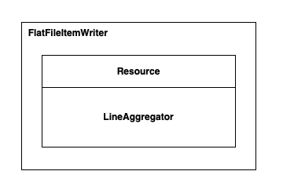

## ItemWriter

### 목차

- [ItemWriter 소개](#-ItemWriter-소개)
- [파일 기반 ItemWriter](#-파일-기반-ItemWriter)
	+ [FlatFileItemWriter](#FlatFileItemWriter)
		* [형식화된 텍스트 파일](#형식화된-텍스트-파일)
		* [구분자로 구분된 파일](#구분자로-구분된-파일)
		* [파일 관리 옵션](#파일-관리-옵션)
	+ [StaxEventItemWriter](#StaxEventItemWriter)

---

### ItemWriter 소개

청크기반으로 처리하는 기능이 나오기전까지 ItemWriter 는 데이터를 읽는 건건이 호출되어 처리했다고 한다.

청크기반 처리 방식이 나오면서 ItemWriter 의 write 메서드는 아이템 목록을 받도록 변경되었다고 한다. (List<T\>)

```java
public interface ItemWriter<T> {
	void write(List<? extends T> items) throws Exception;
}

```

아래 시퀀스 다이어그램과 같이 ItemReader, ItemProcessor 에서 청크 개수만큼 아이템을 처리하고.  
청크하나가 완성되었을때 ItemWriter 에 아이템을 보내서 쓰기 작업을 처리한다. (ItemWriter 호출 횟수가 줄어듬.)


---

### 파일 기반 ItemWriter

파일 기반 item 을 write 하는 방법으로 아래 2가지 writer 가 소개된다.

- FlatFileItemWriter
- StaxEventItemWriter


#### FlatFileItemWriter

LineAggregator 는 7장에서 살펴본 FlatFileItemReader 의 LineMapper 와 비슷한 역할을 한다.

LineMapper 는 파일의 문자열을 객체로 매핑하기 위한 역할이었다면,   
LineAggregator 는 객체를 문자열로 만드는 역할을 한다.



그리고 데이터베이스와 달리 파일의 경우에는 파일이 생성되고 문자가 파일에 써지는(write) 순간부터는 롤백이 어렵다.   
그래서 FlatFileItemWriter 는 실제 쓰기 작업을 가능한 한 늦게 수행되도록 설계되었다고 한다.   
(쓰기 작업외에 모든 작업이 완료된 후 -> 데이터를 실제 파일에 쓰기 바로 전에 트랜잭션을 커밋한다고 한다.)


##### 우선 transaction 이 어디에서부터 적용이 되는건지 아주 간단히 살펴보면...

FlatFileItemWriter 클래스를 보면 AbstractFlatFileItemWriter 클래스를 상속받고 있다.   


해당 클래스의 open() 메소드를 따라가보면 TransactionAwareBufferedWriter 클래스 인스턴스를 생성하고 사용하게 된다.


> if 문에 보이듯이 this.transactional 을 FlatFileItemWriterBuilder 빌더메소드에서 false 로 설정하면 trasanction 처리를 하지 않는다.

TransactionAwareBufferedWriter 클래스에는 getCurrentBuffer() 라는 메소드가 존재하는데, 
해당 메소드 내부에 beforeCommit(), afterCommit(), complete() 과 같이 실제 파일에 내용을 쓰기 위한 코드가 존재한다. 
> 파일에 실제 내용이 써지는 부분은 complete() 메소드에 this.channel.write() 부분에서 써진다.


> 참고로.. 해당 메소드들은 TrasanctionTemplate 클래스 부분에서 commit() 메소드 호출 시 호출된다. (아래에서 간단히 살펴보자.)

##### 책에서 "쓰기 작업외에 모든 작업이 완료된 후 트랜잭션 커밋"이 된다고 하는데 해당 내용을 아주 간단히 살펴보면...

2주전?쯤에 살펴봤던 Step 에서 chunk() 빌더메소드를 사용하게 되면   
 **step 은 TaskletStep 을 사용**하고    
 **tasklet 으로는 ChunkOrientedTasklet** 클래스를 사용한다고 했었다.


> TaskletStep 인스턴스를 생성해서 사용한다.


> TaskletStep 인스턴스에 매개변수로 ChunkOrientedTasklet 을 사용한다.

step 호출을 위한 설정이 완료되면 간단히... 아래와 같은 흐름으로 item writer 가 호출되는데


아래 TrasanctionTemplate 클래스의 코드에서 보이듯이 doInTransaction() 메소드를 호출하고 있다.


doInTransaction() 메소드는 TaskletStep 클래스에 존재하는 메소드를 호출하게 되고,    
아래와 같이 tasklet 의 execute() 메소드를 실행함으로써 item read, process, write 가 차례대로 호출 및 실행된다.


위 코드가 실행되면 몇 단계를(item read, item process 포함) 거치고...    write 관련된 작업들이 처리된다. 

1. listener.beforeWrite()
2. write()
3.  listener.doAfterWrite()


아래와 같은 단계로.. item write() 메소드가 호출되면 


write() 메소드의 str 매개변수는 Customer 객체를 String 화된 값을 매개변수로 받고 
단순히 buffer 에 append 하기만 한다. 


 
위의 getCurrentBuffer() 메소드는 bufferKey 값을 기준으로 기존에 저장된 buffer 데이터를 저장하거나 가져온다.


간단히나마 살펴본... 위 과정으로 execute() 가 끝나면 다시 TaskletStep 클래스로 돌아오고.  
(위 과정으로 단지 문자열을 buffer 에 append 한것밖에 없는것을 기억해야한다.)


그 후 나머지 코드를 진행하면서 step 과 관련된 데이터베이스 업데이트 하는 부분이 존재한다.


위와 같이 Step 과정이 끝나면 다시 TransactionTemplate 클래스로 돌아와서 transactionManager 를 commit() 한다.   


commit() 메소드 내부에 TransactionAwareBufferedWriter 클래스의 complete() 를 호출하기 위한 코드가 존재한다.


위에서 살펴봤지만 다시 한번 보면.. 실제로 파일에 내용이 써지는 코드는 아래 부분이다.
> complete() 메소드에 this.channel.write() 부분


그냥 참고로.. 파일에 내용을 쓰기 위해서는 파일이 먼저 만들어져야 하는데 파일을 만드는 클래스는 AbstractFlatFileItemWriter 이다.  
(위에서 사용했던 이미지 다시 사용..)   


initializeBufferedWriter() 메소드에 2번째줄 코드에서 파일이 생성된다.


---

트랜잭션에 대한 내용을 간단히 훑어봤고...
책에 나온 3가지 예시 코드를 한번 확인해보자

- 형식화된 텍스트 파일
- 구분자로 구분된 파일
- 파일 관리 옵션

##### 형식화된 텍스트 파일

csv 파일을 문장으로 바꿔서 파일에 저장하는 예시코드

as-is
```csv
Richard,N,Darrow,5570 Isabella Ave,St. Louis,IL,58540
```

to-be
```
Richard Darrow lives at 5570 Isabella Ave St. Louis in IL, 58540.
```

item reader 는 기존과 동일하다.

```java
@Bean
@StepScope
public FlatFileItemReader<Customer> customerFileReader(
        @Value("#{jobParameters['customerFile']}") Resource resource
) {
    return new FlatFileItemReaderBuilder<Customer>()
            .name("customerFileReader")
            .resource(resource)
            .delimited()
            .names("firstName", "middleInitial", "lastName", "address", "city", "state", "zipCode")
            .targetType(Customer.class)
            .build();
}
```

> 파일의 문자를 읽어서 Customer 객체에 매핑한다.

item writer 를 살펴보자

```java
@Bean
@StepScope
public FlatFileItemWriter<Customer> customerItemWriter(
        @Value("#{jobParameters['outputFile']}") Resource outputFile
) {
    return new FlatFileItemWriterBuilder<Customer>()
            .name("customerItemWriter")
            .resource(outputFile)
            .formatted()
            .format("%s %s lives at %s %s in %s, %s.")
            .names("firstName", "lastName", "address", "city", "state", "zipCode")
            .build();
}
```

Customer 객체를 읽어와서 format() 메소드의 형태대로 문자를 생성하고, 파라미터로 전달받은 outputFile 파일 위치에 접근해 문자를 저장하도록 되어있다.

책 초반에 LineAggregator 는 객체를 문자열로 만들어 파일에 출력한다고 했었다.   
그럼 위 코드에서 LineAggregator 는 어디에서 적용되고 사용되는걸까?

FlatFileItemWriterBuilder 클래스의 build() 메소드내에서 lingAggregator 를 설정하는 부분이 있다.   


formatted() 빌더 메소드를 사용하기 때문에 formattedBuilder.build() 메소드가 호출되고   
내부에 정의된 FormattedBuilder 클래스의 인스턴스를 사용하게 된다.


FormattedBuilder 클래스의 build() 메소드 내부에는 FormatterLineAggregator 클래스의 인스턴스를 생성하여 사용한다.   
그리고 fieldExtractor 도 할당 받는것을 확인할 수 있다.


대충 아래와 같은 형태가 된다. (대충 그린거라... 대충만 봐주세요)


위와 같이 LineAggregator 설정이 완료된 후에 실제 write 시에는 아래와 같이 사용된다.


1. FlatFileItemWriter 에서는 reader, processor 에서 받아온 아이템들을 반복하여 ExtractorLineAggregator.aggregate(item) 메소드를 호출한다.  


2. ExtractorLineAggregator.aggregate() 메소드에서는 FieldExtractor 클래스의 extract() 메소드로부터 Customer 의 객체로부터 데이터들을 배열의 형태로 추출한다.   


3. 배열의 형태로 추출된 데이터를 FormatterLineAggregator.doAggregate(fields[]) 에 전달해서 String 데이터 포맷으로 변환하고 반환한다.   


##### 구분자로 구분된 파일

이번에는 아래와 같이 ";" 쉼표 구분자로 구분된 내용을 파일에 쓰는 방법에 대해서 나온다.

to-be

```csv
58540;IL;St. Louis;5570 Isabella Ave;Darrow;Richard
```

기존 item writer 코드는 다음과 같다.

```java
@Bean
@StepScope
public FlatFileItemWriter<Customer> customerItemWriter(
        @Value("#{jobParameters['outputFile']}") Resource outputFile
) {
    return new FlatFileItemWriterBuilder<Customer>()
            .name("customerItemWriter")
            .resource(outputFile)
            .delimited()
            .delimiter(";")
            .names("zipCode", "state", "city", "address", "lastName", "firstName")
            .build();
}
```

formatted() 빌더 메소드 대신 delimited() 빌더 메소드를 사용하고 어떤 delimiter 를 사용할 것인지만 지정해주면 간단하게 사용할 수 있다.   

delimited() 빌더 메소드를 호출하면 DelimitedLineAggregator 클래스를 사용하게 되고,   
doAggregate 메소드에서는 단순히 전달받은 delimiter 를 이용해 string join 을 한다.


##### 파일 관리 옵션

FlatFileItemWriterBuilder 클래스에 빌더메소드로 아래와 같은 파일 관리 옵션을 적용할 수 있다.

- shouldDeleteIfEmpty : true 로 설정하면 파일에 아무런 데이터도 써지지 않은 경우 파일을 삭제한다. (기본값은 false)
- shouldDeleteIfExists : false 로 설정하면 동일한 파일 이름이 존재해도 기존 파일을 삭제하지 않는다. (기본값은 true. 즉, 동일한 파일 이름이 존재하면 삭제하고 다시 만듬)
- append : 기존 동일한 파일 이름이 존재하면 해당 파일에 내용을 추가한다. (기본값은 false)


**shouldDeleteIfEmpty**   
true 로 설정하면 close 시점에 써진 내용이 없으면 파일을 제거한다. 


**shouldDeleteIfExists**   
false 로 설정하면 open 시점에 ItemStreamException 을 호출하기 때문에 새로운 파일을 생성하지 않고 에러를 리턴한다.


**append**  
true 로 설정하면 open 시점에 기존 파일이 존재하면 새로운 파일을 생성하지 않는다.    
(파일을 생성하는 createNewFile() 메소드를 호출하지 않음.)


createNewFile() 메소드가 실행되지 않았으면서 기존 path에 append 하도록 되어있다.


---

#### StaxEventItemWriter

Customer 객체의 내용을 파일에 xml 형태로 쓰는 방법에 대해서 알아본다.

```xml
<?xml version="1.0" encoding="UTF-8"?>
<customers>
    <customer>
        <firstName>Richard</firstName>
        <middleInitial>N</middleInitial>
        <lastName>Darrow</lastName><address>5570 Isabella Ave</address>
        <city>St. Louis</city>
        <state>IL</state>
        <zipCode>58540</zipCode>
    </customer>
</customers>
```

우선 트랜잭션 관련 사항은 기존 FlatFileItemWriter 와 동일하게 기본으로 리스너, 디비값 저장 완료 후 제일 마지막으로 파일에 내용이 써지도록 설정되어 있다.

xml 파일로 쓰려면 라이브러리 추가가 필요하다.
```xml
<dependency>
    <groupId>org.springframework</groupId>
    <artifactId>spring-oxm</artifactId>
</dependency>
<dependency>
    <groupId>com.thoughtworks.xstream</groupId>
    <artifactId>xstream</artifactId>
    <version>1.4.10</version>
</dependency>
```

job, step, reader 설정은 기존과 동일하며 writer 만 다르다.
```java
@Bean
@StepScope
public StaxEventItemWriter<Customer> customerItemWriter(
        @Value("#{jobParameters['outputFile']}") Resource outputFile
) {

    Map<String, Class> aliases = new HashMap<>();
    aliases.put("customer", Customer.class);

    XStreamMarshaller marshaller = new XStreamMarshaller();
    marshaller.setAliases(aliases);

    return new StaxEventItemWriterBuilder<Customer>()
            .name("customerItemWriter")
            .resource(outputFile)
            .marshaller(marshaller)
            .rootTagName("customers")
            .build();
}
```

aliases 는 xml 의 태그 이름으로 어떤 이름을 사용할지 설정한다.   
만약 설정하지 않으면 Customer 클래스의 {패키지명}.{클래스명} 을 태그 이름으로 사용하게 된다.
> io.spring.batch.helloworldbatch.domain.Customer

```xml
<?xml version="1.0" encoding="UTF-8"?>
<customers>
    <io.spring.batch.helloworldbatch.domain.Customer>
        <firstName>Richard</firstName>
        <middleInitial>N</middleInitial>
        <lastName>Darrow</lastName><address>5570 Isabella Ave</address>
        <city>St. Louis</city>
        <state>IL</state>
        <zipCode>58540</zipCode>
    </io.spring.batch.helloworldbatch.domain.Customer>
</customers>
```
